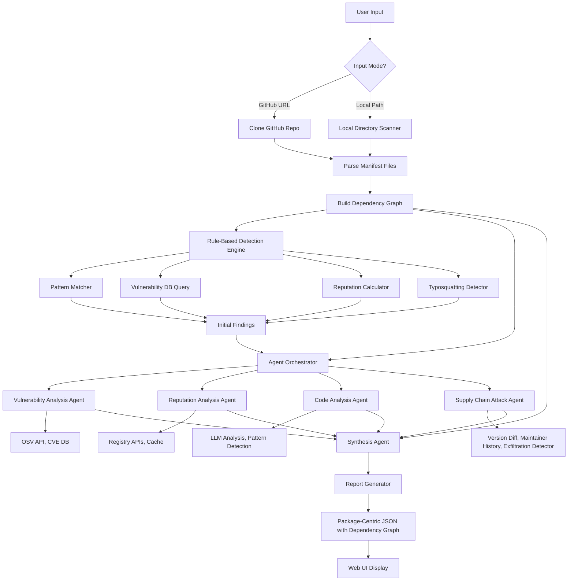
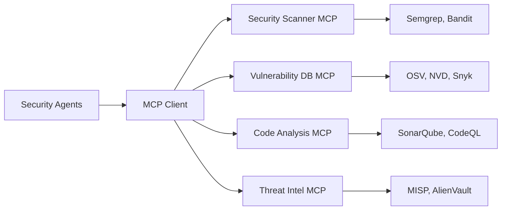
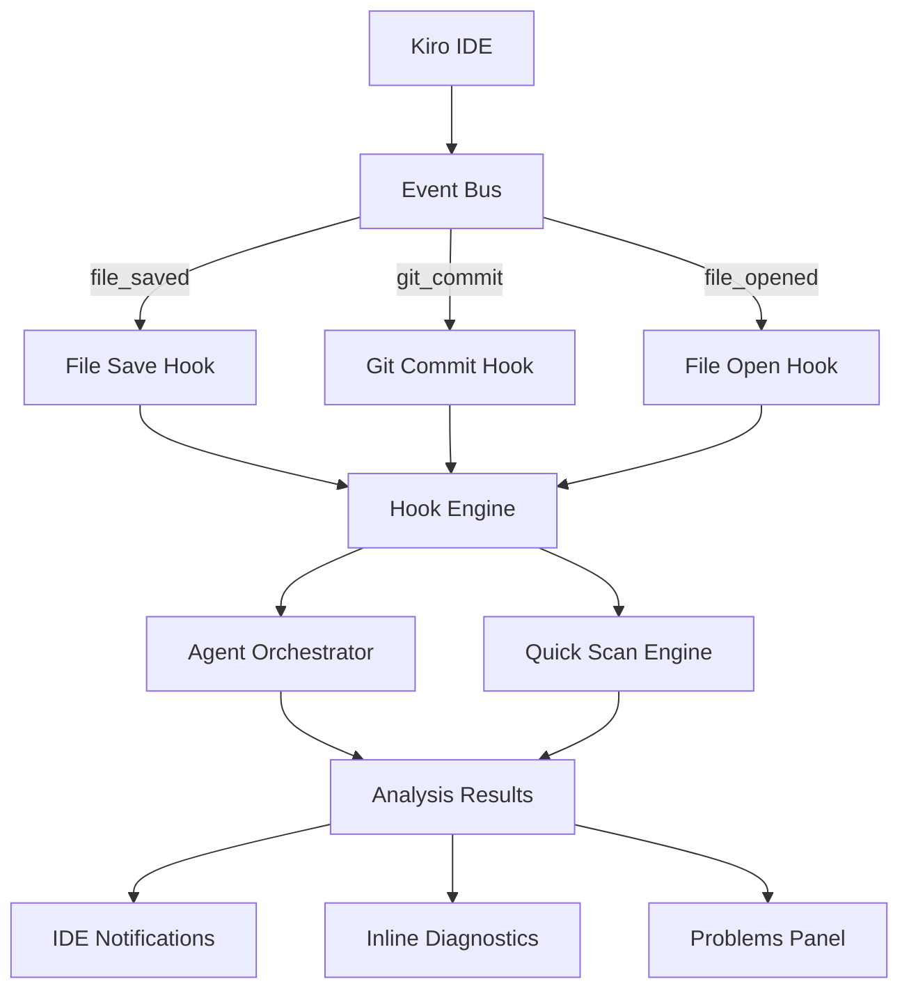
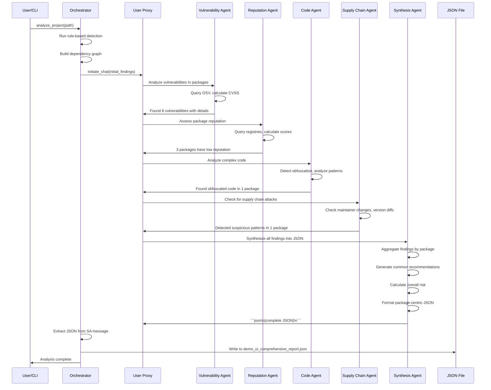

# Design Document: Hybrid Intelligent Agentic Architecture

## Overview

This design transforms the Multi-Agent Security Analysis System into an intelligent hybrid architecture that combines fast rule-based detection with adaptive multi-agent reasoning using Microsoft's AutoGen framework. The system will feature specialized agents that can reason, act, and make decisions collaboratively to provide accurate, contextual security analysis with package-centric reporting.

## Design Iteration Summary

**Version 2.0 - Critical Improvements Based on Feedback**

### What Changed:

1. **✅ Explicit Conversation Protocol** (was: vague "auto" speaker selection)
   - Sequential stages with validation checkpoints
   - Defined timeouts per agent (30s, 20s, 40s, 30s, 20s)
   - Clear failure handling for each stage

2. **✅ Structured JSON Output** (was: fragile regex extraction)
   - Uses OpenAI JSON mode (`response_format={"type": "json_object"}`)
   - Guarantees valid JSON, no parsing errors
   - Schema validation before file write

3. **✅ Concrete Agent-Tool-Data Flow** (was: undefined)
   - Shared context passed between agents
   - Explicit data contracts (AgentResult dataclass)
   - Clear tool execution model with error handling

4. **✅ Performance & Cost Analysis** (was: missing)
   - Detailed execution time breakdown
   - LLM call analysis with token counts
   - Cost estimates: $0.05-0.60 per analysis
   - Optimization strategies (caching, conditional execution)

5. **✅ Comprehensive Error Handling** (was: superficial)
   - Failure mode matrix with user impact
   - Retry logic with exponential backoff
   - Graceful degradation levels (100%, 70%, 40%, <40%)
   - Fallback report generation

6. **✅ Concrete Testing Strategy** (was: generic)
   - Specific test scenarios with code examples
   - Property-based tests with Hypothesis
   - Mock testing for development
   - Performance benchmarks

7. **✅ Observability & Debugging** (was: missing)
   - Structured logging with trace files
   - Debugging tools (dry-run, single-agent, replay)
   - Performance monitoring metrics

8. **✅ Realistic Assessment** (was: over-optimistic)
   - Clear limitations documented
   - Production readiness criteria
   - Implementation timeline (5 weeks)

## Design Principles

1. **Lean & Clear**: Focus on core functionality, avoid over-engineering
2. **Flexible & Extensible**: Support various use cases and future ecosystems
3. **Backward Compatible**: Existing tools and UI continue to work
4. **Incremental Enhancement**: Build on existing codebase, don't rewrite
5. **Optional Features**: MCP and hooks are optional enhancements, not requirements
6. **Production-Ready**: Robust error handling, observability, and testing

## Configuration

**All configurations are stored in `.env` file at project root.**

### Existing Configuration (Already Present)

```bash
# OpenAI API Configuration
OPENAI_API_KEY=your_openai_api_key
OPENAI_MODEL=gpt-4o-mini
OPENAI_VISION_MODEL=gpt-4-vision-preview

# GitHub API Configuration
GITHUB_TOKEN=your_github_token

# System Configuration
CACHE_ENABLED=true
CACHE_DURATION_HOURS=24
OUTPUT_DIRECTORY=outputs

# Agent Configuration (used by AutoGen agents)
AGENT_TEMPERATURE=0.1
AGENT_MAX_TOKENS=4096
AGENT_TIMEOUT_SECONDS=120
AGENT_MAX_ROUNDS=12

# OSV API Configuration
OSV_API_BASE_URL=https://api.osv.dev
OSV_API_TIMEOUT=30

# Analysis Configuration
CONFIDENCE_THRESHOLD=0.7
```

### New Configuration (To Be Added)

```bash
# AutoGen Agent Configuration
AUTOGEN_CACHE_SEED=42
AUTOGEN_MAX_CONSECUTIVE_AUTO_REPLY=10

# MCP Server Configuration (Optional)
MCP_ENABLED=false
MCP_CONFIG_PATH=.kiro/settings/mcp.json

# Kiro Hooks Configuration (Optional)
HOOKS_ENABLED=false
HOOKS_CONFIG_PATH=.kiro/hooks/security-scan.json
HOOKS_NOTIFY_CRITICAL=true
HOOKS_NOTIFY_HIGH=true
HOOKS_NOTIFY_MEDIUM=false
HOOKS_NOTIFY_LOW=false
HOOKS_BLOCK_COMMIT_ON_CRITICAL=true

# Threat Intelligence API Keys (Optional)
VIRUSTOTAL_API_KEY=your_virustotal_key
SOCKET_API_KEY=your_socket_dev_key
SNYK_API_KEY=your_snyk_key
```

**Note:** All API keys and sensitive data are stored in `.env` and never committed to version control.

## Initial Implementation Scope

**Core Features (Required):**
- ✅ Hybrid architecture (rule-based + agents)
- ✅ 5 specialized agents (Vulnerability, Reputation, Code, Supply Chain, Synthesis)
- ✅ Package-centric JSON output
- ✅ Dependency graph analysis
- ✅ npm and Python support (using existing analyzers)
- ✅ Both input modes (GitHub URL and local directory)

**Optional Features (Future Enhancements):**
- ⚠️ MCP server integration (extensibility for external tools)
- ⚠️ Kiro agent hooks (IDE integration for real-time scanning)
- ⚠️ Additional ecosystems (Rust, Go, Java, etc.)

**No Changes Required:**
- ❌ Flask web UI (`app.py`) - works with new JSON format
- ❌ Existing analyzers (`NpmAnalyzer`, `PythonAnalyzer`) - reused as-is
- ❌ Existing tools (`cache_manager.py`, `reputation_service.py`) - reused as-is

## Architecture

### Ecosystem Support

**Initial Implementation:**
- **npm**: Uses existing `NpmAnalyzer` from `tools/npm_analyzer.py`
- **Python**: Uses existing `PythonAnalyzer` from `tools/python_analyzer.py`

**Extensibility:**
The architecture is designed to support additional ecosystems (Rust, Go, Java, etc.) by:
1. Implementing the `EcosystemAnalyzer` base class
2. Registering with `AnalyzerRegistry`
3. Agents automatically work with new ecosystems (no agent changes needed)

### Input Modes

The system supports two input modes, and agents adapt their analysis accordingly:

#### Mode 1: Remote Repository (GitHub URL)
**Input:** `https://github.com/owner/repo`

**Process:**
1. Clone the repository to temporary directory
2. Analyze manifest files (package.json, requirements.txt, etc.)
3. Build complete dependency graph from manifest files
4. Query GitHub API for version history and maintainer data
5. Perform full security analysis on cloned code

**Agent Capabilities:**
- ✅ Full version history analysis (via GitHub API)
- ✅ Maintainer change detection (via GitHub commits)
- ✅ Code diff between versions (via GitHub API)
- ✅ Publishing pattern analysis (via registry + GitHub)
- ✅ Contributor history analysis
- ✅ Commit timeline analysis
- ✅ Complete dependency graph (from cloned manifest files)
- ✅ Transitive dependency analysis (full dependency tree)

**Tools Available:**
- `clone_github_repo()` - Clone repository to temporary directory
- `fetch_github_metadata()` - Get repo metadata, contributors, commits
- `fetch_github_version_history()` - Get all releases and tags
- `compare_github_commits()` - Diff between commits
- `analyze_github_contributors()` - Analyze contributor patterns
- `build_dependency_graph()` - Parse manifest files and build complete dependency tree

#### Mode 2: Local Directory
**Input:** `/path/to/project` or `C:\Users\...\project`

**Process:**
1. Scan directory for manifest files
2. Parse manifest files to extract dependencies
3. Build complete dependency graph from manifest files
4. Query registries for package metadata
5. Perform security analysis on local code

**Agent Capabilities:**
- ✅ Current code analysis (files on disk)
- ✅ Dependency analysis (from manifest files)
- ✅ Pattern detection (in local code)
- ✅ Complete dependency graph (from manifest files)
- ✅ Transitive dependency analysis (full dependency tree)
- ⚠️ Limited version history (only if .git present)
- ⚠️ No maintainer history (unless queried from registry)

**Tools Available:**
- `scan_local_files()` - Scan all files in directory
- `parse_manifest_files()` - Extract dependencies from package.json, requirements.txt
- `build_dependency_graph()` - Parse manifest files and build complete dependency tree
- `analyze_local_code()` - Pattern matching and LLM analysis
- `query_registry_for_metadata()` - Fetch metadata for detected packages

**Agent Adaptation:**
```python
class SupplyChainAttackAgent:
    def analyze(self, context: Dict) -> Dict:
        input_mode = context['input_mode']  # 'github' or 'local'
        
        if input_mode == 'github':
            # Full supply chain analysis
            return self._analyze_remote_repo(context)
        else:
            # Limited to local code + registry queries
            return self._analyze_local_directory(context)
    
    def _analyze_remote_repo(self, context: Dict) -> Dict:
        """Full analysis with version history"""
        # Can detect maintainer changes, version diffs, etc.
        maintainer_history = self.fetch_github_metadata(context['repo_url'])
        version_diffs = self.compare_github_commits(context['repo_url'])
        # ... full analysis
    
    def _analyze_local_directory(self, context: Dict) -> Dict:
        """Limited analysis, query registries for metadata"""
        # Analyze local code
        local_findings = self.scan_local_files(context['directory'])
        
        # For each package found, query registry for metadata
        for package in local_findings['packages']:
            metadata = self.query_registry_for_metadata(package['name'], package['ecosystem'])
            # Check for known compromises in registry data
```

### High-Level Architecture



### Two-Layer Architecture

#### Layer 1: Rule-Based Detection (Fast & Deterministic)
**Execution Time:** < 5 seconds
**Purpose:** Quick detection of known patterns

**Components:**
1. **Pattern Matcher**
   - Regex-based malicious code detection
   - Suspicious network activity detection
   - Known vulnerability signatures

2. **Vulnerability Database Query**
   - OSV API integration
   - CVE database lookup
   - Cached vulnerability data

3. **Reputation Calculator**
   - Package age analysis
   - Download statistics
   - Author reputation scoring
   - Maintenance metrics

4. **Typosquatting Detector**
   - Levenshtein distance calculation
   - Popular package comparison
   - Homoglyph detection

**Output:** Initial findings with confidence scores and detection method tags

#### Layer 2: Agentic Workflow (Intelligent & Adaptive)
**Execution Time:** < 2 minutes total
**Purpose:** Deep analysis, reasoning, and synthesis

**Agent Architecture:**

```python
import os
from dotenv import load_dotenv

# Load configuration from .env file
load_dotenv()

# Agent Base Class
class SecurityAgent:
    def __init__(self, name: str, system_message: str, tools: List[Callable]):
        self.name = name
        
        # Load configuration from .env
        self.llm_config = {
            "model": os.getenv("OPENAI_MODEL", "gpt-4o-mini"),
            "api_key": os.getenv("OPENAI_API_KEY"),
            "temperature": float(os.getenv("AGENT_TEMPERATURE", "0.1")),
            "max_tokens": int(os.getenv("AGENT_MAX_TOKENS", "4096")),
            "timeout": int(os.getenv("AGENT_TIMEOUT_SECONDS", "120")),
            "cache_seed": 42
        }
        
        self.tools = tools
        self.agent = autogen.AssistantAgent(
            name=name,
            system_message=system_message,
            llm_config=self.llm_config
        )
    
    def register_tools(self):
        """Register tools with the agent"""
        for tool in self.tools:
            self.agent.register_function(
                function_map={tool.__name__: tool}
            )
    
    def analyze(self, context: Dict) -> Dict:
        """Perform analysis and return results"""
        pass
```

**Configuration:** All agent settings are loaded from `.env` file at project root.

## Input Mode Handling

### Agent Intelligence: Adaptive Analysis

Agents intelligently adapt their analysis based on available data:

| Analysis Type | GitHub Mode | Local Mode | Agent Strategy |
|---------------|-------------|------------|----------------|
| **Version History** | ✅ Full history via GitHub API | ⚠️ Limited (only if .git present) | Query registry APIs for version metadata |
| **Maintainer Changes** | ✅ Via GitHub commits/contributors | ❌ Not available locally | Query registry APIs for maintainer history |
| **Code Diffs** | ✅ Via GitHub API | ⚠️ Only if .git present | Download versions from registry and diff |
| **Publishing Patterns** | ✅ Via GitHub + registry | ✅ Via registry APIs | Always query registry for publishing data |
| **Current Code Analysis** | ✅ Clone and analyze | ✅ Direct file access | Same analysis for both |
| **Dependency Graph** | ✅ Full graph (from cloned repo) | ✅ Full graph (from local files) | Parse manifest files and build complete dependency tree in both modes |
| **Transitive Dependencies** | ✅ Complete tree | ✅ Complete tree | Recursively resolve all dependencies |
| **Vulnerability Tracing** | ✅ Full path analysis | ✅ Full path analysis | Trace vulnerable packages through dependency chains |

### Intelligent Fallback Strategy

```python
class AgentIntelligence:
    """Agents use intelligent fallback strategies"""
    
    def get_version_history(self, package_name: str, input_mode: str, context: Dict) -> Dict:
        """
        Get version history using best available method.
        
        Priority:
        1. GitHub API (if GitHub mode)
        2. Local .git history (if available)
        3. Registry API (always available)
        """
        if input_mode == 'github':
            # Best: Full GitHub history
            return self.fetch_github_version_history(context['repo_url'])
        
        elif self.has_local_git(context['directory']):
            # Good: Local git history
            return self.parse_local_git_history(context['directory'])
        
        else:
            # Fallback: Query registry for version list
            return self.query_registry_version_history(package_name, context['ecosystem'])
    
    def get_maintainer_history(self, package_name: str, input_mode: str, context: Dict) -> Dict:
        """
        Get maintainer history using best available method.
        
        Priority:
        1. GitHub API (if GitHub mode)
        2. Registry API (always available)
        """
        if input_mode == 'github':
            # Best: GitHub contributors and commit history
            return self.fetch_github_contributors(context['repo_url'])
        
        else:
            # Fallback: Registry maintainer data
            return self.query_registry_maintainers(package_name, context['ecosystem'])
    
    def compare_versions(self, package_name: str, v1: str, v2: str, input_mode: str, context: Dict) -> Dict:
        """
        Compare two versions using best available method.
        
        Priority:
        1. GitHub API (if GitHub mode)
        2. Download from registry and diff
        """
        if input_mode == 'github':
            # Best: GitHub commit diff
            return self.fetch_github_diff(context['repo_url'], v1, v2)
        
        else:
            # Fallback: Download versions from registry and diff
            return self.download_and_diff_from_registry(package_name, v1, v2, context['ecosystem'])
```

### Example: Supply Chain Agent Adapts to Input Mode

**Scenario 1: GitHub Repository**
```python
# User input: https://github.com/expressjs/express
# Agent has FULL capabilities

agent_analysis = {
    "input_mode": "github",
    "capabilities": "full",
    
    "maintainer_analysis": {
        "source": "GitHub API",
        "data": "Complete contributor history with commit patterns",
        "confidence": 0.95
    },
    
    "version_analysis": {
        "source": "GitHub releases + commits",
        "data": "Full version history with code diffs",
        "confidence": 0.95
    },
    
    "supply_chain_assessment": {
        "confidence": 0.95,
        "reasoning": "Full history available, high confidence in assessment"
    }
}
```

**Scenario 2: Local Directory**
```python
# User input: C:\Users\...\my-project
# Agent adapts with fallback strategies

agent_analysis = {
    "input_mode": "local",
    "capabilities": "limited_with_fallback",
    
    "maintainer_analysis": {
        "source": "npm Registry API (fallback)",
        "data": "Maintainer list from registry, limited history",
        "confidence": 0.75,
        "note": "Limited to registry data, no GitHub commit history"
    },
    
    "version_analysis": {
        "source": "Registry API + downloaded versions",
        "data": "Version list from registry, downloaded and diffed suspicious versions",
        "confidence": 0.80,
        "note": "Downloaded versions from registry for diff analysis"
    },
    
    "supply_chain_assessment": {
        "confidence": 0.80,
        "reasoning": "Limited history, but registry data + code analysis provides good coverage"
    }
}
```

### Agent Decision Making

Agents make intelligent decisions based on available data:

```python
class SupplyChainAttackAgent:
    def decide_analysis_depth(self, context: Dict) -> str:
        """
        Decide analysis depth based on input mode and available data.
        
        Returns: 'full', 'standard', or 'basic'
        """
        if context['input_mode'] == 'github':
            return 'full'  # All capabilities available
        
        elif self.has_local_git(context.get('directory')):
            return 'standard'  # Some history available
        
        else:
            return 'basic'  # Only registry queries + local code
    
    def analyze(self, context: Dict) -> Dict:
        depth = self.decide_analysis_depth(context)
        
        if depth == 'full':
            # Use GitHub API for everything
            return self._full_analysis(context)
        
        elif depth == 'standard':
            # Use local git + registry APIs
            return self._standard_analysis(context)
        
        else:
            # Use registry APIs + local code analysis
            return self._basic_analysis(context)
```

## Components and Interfaces

### 1. Main Analysis Entry Point

**Location:** `analyze_supply_chain.py` (enhanced)

**Purpose:** Main entry point that coordinates rule-based detection and agent analysis

**Interface:**
```python
import os
from dotenv import load_dotenv
from agents.orchestrator import AgentOrchestrator
from tools.dependency_graph import DependencyGraphAnalyzer

load_dotenv()

def analyze_project(target: str, input_mode: str = "auto") -> str:
    """
    Main entry point for security analysis.
    
    Args:
        target: GitHub URL or local directory path
        input_mode: "github", "local", or "auto" (auto-detect)
    
    Returns:
        Path to generated JSON report
    """
    # Step 1: Detect input mode
    if input_mode == "auto":
        input_mode = "github" if target.startswith("http") else "local"
    
    # Step 2: Get project files
    if input_mode == "github":
        project_dir = clone_github_repo(target)
    else:
        project_dir = target
    
    # Step 3: Build dependency graph
    dep_analyzer = DependencyGraphAnalyzer()
    dependency_graph = dep_analyzer.build_graph(project_dir)
    packages = dep_analyzer.extract_packages(dependency_graph)
    
    # Step 4: Run rule-based detection (fast layer)
    rule_engine = RuleBasedDetectionEngine()
    initial_findings = rule_engine.detect(packages)
    
    # Step 5: Run agent analysis (intelligent layer)
    orchestrator = AgentOrchestrator()
    final_json = orchestrator.orchestrate(initial_findings, dependency_graph)
    
    # Step 6: Return output path
    output_path = os.path.join(
        os.getenv("OUTPUT_DIRECTORY", "outputs"),
        "demo_ui_comprehensive_report.json"
    )
    
    return output_path


class RuleBasedDetectionEngine:
    """Fast, deterministic detection layer"""
    
    def __init__(self):
        self.pattern_matcher = PatternMatcher()
        self.vuln_db = VulnerabilityDatabase()
        self.reputation_calc = ReputationCalculator()
        self.typosquat_detector = TyposquattingDetector()
    
    def detect(self, packages: List[Package]) -> List[Finding]:
        """
        Run rule-based detection on packages.
        
        Returns:
            List of findings with detection_method='rule_based'
        """
        findings = []
        
        # Pattern matching
        findings.extend(self.pattern_matcher.scan(packages))
        
        # Vulnerability database lookup
        findings.extend(self.vuln_db.query(packages))
        
        # Reputation scoring
        findings.extend(self.reputation_calc.score(packages))
        
        # Typosquatting detection
        findings.extend(self.typosquat_detector.check(packages))
        
        return findings
```

**Usage:**
```python
# Analyze GitHub repository
analyze_project("https://github.com/expressjs/express")

# Analyze local directory
analyze_project("/path/to/project")

# Output: outputs/demo_ui_comprehensive_report.json
```

### 2. Agent Orchestrator (Explicit Protocol)

**Location:** `agents/orchestrator.py` (new)

**Purpose:** Coordinates multi-agent analysis using explicit conversation protocol with validation

**Conversation Protocol (Sequential with Validation):**

```
Stage 1: Vulnerability Analysis (Required)
  → Vulnerability Agent analyzes all packages
  → Validation: Must return findings for each package with vulnerabilities
  → Timeout: 30 seconds
  → On failure: Use rule-based findings only

Stage 2: Reputation Analysis (Required)
  → Reputation Agent assesses all packages
  → Validation: Must return reputation score for each package
  → Timeout: 20 seconds
  → On failure: Use default reputation scores

Stage 3: Code Analysis (Conditional)
  → Code Agent analyzes packages with suspicious patterns
  → Validation: Must return analysis for flagged packages
  → Timeout: 40 seconds
  → On failure: Skip code analysis, note in report

Stage 4: Supply Chain Analysis (Conditional)
  → Supply Chain Agent checks for sophisticated attacks
  → Validation: Must return attack indicators
  → Timeout: 30 seconds
  → On failure: Skip supply chain analysis, note in report

Stage 5: Synthesis (Required)
  → Synthesis Agent produces final JSON using OpenAI JSON mode
  → Validation: JSON schema validation
  → Timeout: 20 seconds
  → On failure: Generate report from available data

Total Max Time: 140 seconds (2.3 minutes)
```

**Interface:**
```python
import os
from dotenv import load_dotenv
import json
from typing import Dict, List, Optional
from dataclasses import dataclass
import time

load_dotenv()

@dataclass
class AgentResult:
    """Result from an agent with validation"""
    agent_name: str
    success: bool
    data: Dict
    error: Optional[str] = None
    duration_seconds: float = 0.0

class AgentOrchestrator:
    """Coordinates multi-agent analysis using explicit sequential protocol"""
    
    def __init__(self):
        # Load configuration from .env
        self.output_dir = os.getenv("OUTPUT_DIRECTORY", "outputs")
        
        # Initialize agents
        self.vuln_agent = VulnerabilityAnalysisAgent()
        self.rep_agent = ReputationAnalysisAgent()
        self.code_agent = CodeAnalysisAgent()
        self.supply_chain_agent = SupplyChainAttackAgent()
        self.synth_agent = SynthesisAgent()
        
        # Shared context for agents
        self.shared_context = {}
    
    def orchestrate(self, initial_findings: List[Finding], dependency_graph: Dict) -> Dict:
        """
        Orchestrate multi-agent analysis using explicit sequential protocol.
        
        Protocol:
        1. Vulnerability Agent (required, 30s timeout)
        2. Reputation Agent (required, 20s timeout)
        3. Code Agent (conditional, 40s timeout)
        4. Supply Chain Agent (conditional, 30s timeout)
        5. Synthesis Agent (required, 20s timeout) - Uses OpenAI JSON mode
        
        Returns:
            Package-centric JSON output (written to file)
        """
        start_time = time.time()
        
        # Initialize shared context
        self.shared_context = {
            "initial_findings": initial_findings,
            "dependency_graph": dependency_graph,
            "packages": self._extract_packages(initial_findings),
            "agent_results": {}
        }
        
        # Stage 1: Vulnerability Analysis (Required)
        vuln_result = self._run_agent_stage(
            agent=self.vuln_agent,
            stage_name="vulnerability_analysis",
            timeout=30,
            required=True
        )
        self.shared_context["agent_results"]["vulnerability"] = vuln_result
        
        # Stage 2: Reputation Analysis (Required)
        rep_result = self._run_agent_stage(
            agent=self.rep_agent,
            stage_name="reputation_analysis",
            timeout=20,
            required=True
        )
        self.shared_context["agent_results"]["reputation"] = rep_result
        
        # Stage 3: Code Analysis (Conditional - only if suspicious patterns found)
        if self._has_suspicious_patterns(initial_findings):
            code_result = self._run_agent_stage(
                agent=self.code_agent,
                stage_name="code_analysis",
                timeout=40,
                required=False
            )
            self.shared_context["agent_results"]["code"] = code_result
        
        # Stage 4: Supply Chain Analysis (Conditional - only if high-risk packages)
        if self._has_high_risk_packages(self.shared_context):
            sc_result = self._run_agent_stage(
                agent=self.supply_chain_agent,
                stage_name="supply_chain_analysis",
                timeout=30,
                required=False
            )
            self.shared_context["agent_results"]["supply_chain"] = sc_result
        
        # Stage 5: Synthesis (Required) - Uses OpenAI JSON mode for guaranteed valid JSON
        final_json = self._run_synthesis_stage(timeout=20)
        
        # Add performance metrics
        final_json["performance_metrics"] = {
            "total_duration_seconds": time.time() - start_time,
            "agent_durations": {
                name: result.duration_seconds 
                for name, result in self.shared_context["agent_results"].items()
            }
        }
        
        # Write to output file
        output_path = os.path.join(self.output_dir, "demo_ui_comprehensive_report.json")
        with open(output_path, 'w') as f:
            json.dump(final_json, f, indent=2)
        
        return final_json
    
    def _run_agent_stage(
        self, 
        agent, 
        stage_name: str, 
        timeout: int, 
        required: bool
    ) -> AgentResult:
        """
        Run a single agent stage with timeout and validation.
        
        Returns:
            AgentResult with success/failure and data
        """
        start_time = time.time()
        
        try:
            # Call agent with shared context and timeout
            result_data = agent.analyze(
                context=self.shared_context,
                timeout=timeout
            )
            
            # Validate result
            if not self._validate_agent_result(agent, result_data):
                raise ValueError(f"Agent {stage_name} returned invalid data")
            
            return AgentResult(
                agent_name=stage_name,
                success=True,
                data=result_data,
                duration_seconds=time.time() - start_time
            )
            
        except Exception as e:
            # Log error and return failure result
            error_msg = f"Agent {stage_name} failed: {str(e)}"
            print(f"ERROR: {error_msg}")
            
            if required:
                # For required agents, use fallback data
                fallback_data = self._get_fallback_data(stage_name)
                return AgentResult(
                    agent_name=stage_name,
                    success=False,
                    data=fallback_data,
                    error=error_msg,
                    duration_seconds=time.time() - start_time
                )
            else:
                # For optional agents, return empty result
                return AgentResult(
                    agent_name=stage_name,
                    success=False,
                    data={},
                    error=error_msg,
                    duration_seconds=time.time() - start_time
                )
    
    def _run_synthesis_stage(self, timeout: int) -> Dict:
        """
        Run synthesis stage using OpenAI JSON mode for guaranteed valid JSON.
        
        This uses OpenAI's response_format={"type": "json_object"} to ensure
        the output is always valid JSON, eliminating regex parsing issues.
        """
        try:
            # Synthesis agent uses OpenAI JSON mode
            final_json = self.synth_agent.synthesize_json(
                context=self.shared_context,
                timeout=timeout,
                use_json_mode=True  # Forces valid JSON output
            )
            
            # Validate against schema
            self._validate_json_schema(final_json)
            
            return final_json
            
        except Exception as e:
            print(f"ERROR: Synthesis failed: {str(e)}")
            # Generate report from available data
            return self._generate_fallback_report(self.shared_context)
    
    def _extract_packages(self, findings: List[Finding]) -> List[str]:
        """Extract unique package names from findings"""
        return list(set(f.package_name for f in findings))
    
    def _has_suspicious_patterns(self, findings: List[Finding]) -> bool:
        """Check if any findings have suspicious code patterns"""
        return any(f.finding_type in ["obfuscated_code", "suspicious_script"] for f in findings)
    
    def _has_high_risk_packages(self, context: Dict) -> bool:
        """Check if any packages are high risk (low reputation or critical vulns)"""
        rep_result = context["agent_results"].get("reputation")
        if not rep_result or not rep_result.success:
            return False
        
        # Check for low reputation packages
        for pkg_data in rep_result.data.get("packages", []):
            if pkg_data.get("reputation_score", 1.0) < 0.3:
                return True
        
        return False
    
    def _validate_agent_result(self, agent, result_data: Dict) -> bool:
        """Validate agent result has required fields"""
        if not isinstance(result_data, dict):
            return False
        
        # Each agent must return a "packages" key with analysis
        if "packages" not in result_data:
            return False
        
        return True
    
    def _get_fallback_data(self, stage_name: str) -> Dict:
        """Get fallback data when agent fails"""
        if stage_name == "vulnerability_analysis":
            # Use rule-based findings
            return {"packages": [], "source": "rule_based_fallback"}
        elif stage_name == "reputation_analysis":
            # Use default reputation scores
            return {"packages": [], "source": "default_scores"}
        else:
            return {"packages": [], "source": "fallback"}
    
    def _validate_json_schema(self, json_data: Dict) -> bool:
        """Validate final JSON against expected schema"""
        required_keys = ["metadata", "summary", "security_findings", "recommendations"]
        return all(key in json_data for key in required_keys)
    
    def _generate_fallback_report(self, context: Dict) -> Dict:
        """Generate report from available data when synthesis fails"""
        return {
            "metadata": {
                "analysis_id": f"analysis_{int(time.time())}",
                "analysis_type": "partial",
                "error": "Synthesis agent failed, using fallback report"
            },
            "summary": {},
            "security_findings": [],
            "recommendations": ["Analysis incomplete - please retry"],
            "agent_insights": {
                "error": "Synthesis failed, partial results only"
            }
        }
    
    def _create_analysis_prompt(self, findings: List[Finding], dep_graph: Dict) -> str:
        """Create initial prompt for agent conversation"""
        return f"""
Analyze the following security findings and produce a comprehensive package-centric JSON report.

Initial Findings from Rule-Based Detection:
{json.dumps([f.to_dict() for f in findings], indent=2)}

Dependency Graph:
{json.dumps(dep_graph, indent=2)}

Required Output Format:
- Package-centric structure (packages as parent nodes)
- Each package contains: vulnerabilities, reputation_analysis, dependency_info, recommendations
- Include agent_insights with reasoning and confidence scores
- Generate common_recommendations across all packages
- Include dependency_graph visualization

Agents should collaborate to:
1. Vulnerability Agent: Deep analysis of each vulnerability
2. Reputation Agent: Assess package trustworthiness
3. Code Agent: Analyze complex/obfuscated code
4. Supply Chain Agent: Detect sophisticated attacks (Hulud-style)
5. Synthesis Agent: Combine all findings into final JSON

Synthesis Agent will produce the final JSON output.
"""
    
    def _extract_final_json(self, messages: List[Dict]) -> Dict:
        """
        Extract final JSON from synthesis agent's last message.
        
        The synthesis agent's final message should contain the complete
        package-centric JSON output.
        """
        # Find last message from synthesis agent
        for message in reversed(messages):
            if message.get("name") == "synthesis_agent":
                content = message.get("content", "")
                
                # Extract JSON from message (may be wrapped in markdown)
                if "```json" in content:
                    json_str = content.split("```json")[1].split("```")[0].strip()
                elif "```" in content:
                    json_str = content.split("```")[1].split("```")[0].strip()
                else:
                    json_str = content.strip()
                
                try:
                    return json.loads(json_str)
                except json.JSONDecodeError:
                    # If parsing fails, try to extract JSON object
                    import re
                    json_match = re.search(r'\{.*\}', content, re.DOTALL)
                    if json_match:
                        return json.loads(json_match.group())
        
        # Fallback: return empty structure
        return self._create_empty_report()
    
    def _create_empty_report(self) -> Dict:
        """Create empty report structure if extraction fails"""
        return {
            "metadata": {},
            "summary": {},
            "packages": [],
            "dependency_graph": {},
            "common_recommendations": {},
            "agent_insights": {},
            "cache_statistics": {},
            "performance_metrics": {}
        }
```

**Key Design Points:**

1. **GroupChat Coordination**: AutoGen's GroupChat manages agent conversation flow
2. **Speaker Selection**: AutoGen automatically decides which agent speaks next based on context
3. **Synthesis Agent Produces JSON**: The synthesis agent's final message contains the complete JSON output
4. **JSON Extraction**: Orchestrator extracts JSON from synthesis agent's message (handles markdown wrapping)
5. **File Output**: Final JSON written to `outputs/demo_ui_comprehensive_report.json`
6. **Configuration**: All settings loaded from `.env` file

### 3. Vulnerability Analysis Agent

**Location:** `agents/vulnerability_agent.py` (new)

**System Message:**
```
You are a Vulnerability Analysis Agent specializing in security vulnerability assessment.

Your task: Analyze packages for known vulnerabilities and assess their impact.

Input: You will receive a list of packages with initial vulnerability findings.
Output: Return JSON with detailed vulnerability analysis for each package.

Required output format:
{
  "packages": [
    {
      "name": "package-name",
      "version": "1.0.0",
      "vulnerabilities": [
        {
          "id": "CVE-2021-12345",
          "severity": "critical",
          "cvss_score": 9.8,
          "description": "...",
          "affected_versions": "< 1.0.1",
          "fixed_version": "1.0.1",
          "confidence": 0.95,
          "reasoning": "Confirmed via OSV database..."
        }
      ]
    }
  ]
}

Analysis steps:
1. Query OSV API for each package
2. Calculate CVSS scores
3. Assess combined impact of multiple vulnerabilities
4. Identify affected versions and fixes
5. Provide confidence scores with reasoning

Always provide evidence-based analysis. If no vulnerabilities found, return empty array.
```

**Example Prompt:**
```
Analyze these packages for vulnerabilities:

Packages:
- lodash@4.17.20
- express@4.18.2
- flatmap-stream@0.1.1

Initial findings from rule-based detection:
- lodash@4.17.20: Potential CVE-2021-23337
- flatmap-stream@0.1.1: Flagged as malicious package

Provide detailed vulnerability analysis with CVSS scores and remediation advice.
```

**Tools:**
```python
def query_osv_api(package_name: str, version: str, ecosystem: str) -> Dict:
    """Query OSV API for vulnerability information"""
    pass

def query_cve_db(cve_id: str) -> Dict:
    """Query CVE database for detailed vulnerability information"""
    pass

def calculate_cvss(vulnerability_data: Dict) -> float:
    """Calculate CVSS score from vulnerability data"""
    pass

def get_cached_vuln(package_name: str, version: str) -> Optional[Dict]:
    """Retrieve cached vulnerability information"""
    pass
```

### 4. Reputation Analysis Agent

**Location:** `agents/reputation_agent.py` (new)

**System Message:**
```
You are a Reputation Analysis Agent specializing in package trustworthiness assessment.

Your responsibilities:
1. Fetch package metadata from registries (npm, PyPI)
2. Calculate reputation scores based on age, downloads, author, maintenance
3. Identify specific risk factors (new package, unknown author, etc.)
4. Detect suspicious patterns in author history
5. Provide risk assessment with confidence scores

Tools available:
- fetch_npm_metadata: Fetch package metadata from npm registry
- fetch_pypi_metadata: Fetch package metadata from PyPI
- calculate_reputation_score: Calculate overall reputation score
- analyze_author_history: Analyze package author's history
- get_cached_reputation: Retrieve cached reputation data

Always explain risk factors and provide evidence for assessments.
```

**Tools:**
```python
def fetch_npm_metadata(package_name: str) -> Dict:
    """Fetch package metadata from npm registry"""
    pass

def fetch_pypi_metadata(package_name: str) -> Dict:
    """Fetch package metadata from PyPI"""
    pass

def calculate_reputation_score(metadata: Dict) -> Dict:
    """Calculate reputation score with factor breakdown"""
    pass

def analyze_author_history(author: str, ecosystem: str) -> Dict:
    """Analyze package author's history and reputation"""
    pass

def get_cached_reputation(package_name: str, ecosystem: str) -> Optional[Dict]:
    """Retrieve cached reputation data"""
    pass
```

### 5. Code Analysis Agent

**Location:** `agents/code_agent.py` (new)

**System Message:**
```
You are a Code Analysis Agent specializing in security code review and malware detection.

Your responsibilities:
1. Analyze complex or obfuscated code using LLM-based analysis
2. Detect obfuscation techniques (base64, eval, dynamic execution)
3. Explain security implications of suspicious patterns
4. Identify behavioral indicators (network activity, file access, process spawning)
5. Provide detailed code review with security assessment

Tools available:
- analyze_code_with_llm: Deep code analysis using LLM
- detect_obfuscation: Detect code obfuscation techniques
- analyze_behavior: Analyze code behavior patterns
- calculate_complexity: Calculate code complexity score
- get_cached_analysis: Retrieve cached code analysis

Always provide clear explanations of security risks and confidence scores.
```

**Tools:**
```python
def analyze_code_with_llm(code: str, context: str) -> Dict:
    """Perform deep code analysis using LLM"""
    pass

def detect_obfuscation(code: str) -> Dict:
    """Detect code obfuscation techniques"""
    pass

def analyze_behavior(code: str) -> Dict:
    """Analyze code behavior patterns"""
    pass

def calculate_complexity(code: str) -> float:
    """Calculate code complexity score"""
    pass

def get_cached_analysis(code_hash: str) -> Optional[Dict]:
    """Retrieve cached code analysis"""
    pass
```

### 6. Supply Chain Attack Detection Agent

**Location:** `agents/supply_chain_agent.py` (new)

**System Message:**
```
You are a Supply Chain Attack Detection Agent specializing in identifying sophisticated supply chain attacks like Huld, event-stream, and similar compromises.

Your responsibilities:
1. Detect suspicious maintainer changes and account compromises
2. Analyze version history for malicious injections
3. Compare code diffs between versions for subtle malicious changes
4. Identify time-delayed activation patterns
5. Detect targeted data exfiltration (environment variables, credentials, tokens)
6. Flag dependency confusion and typosquatting attacks
7. Identify suspicious publishing patterns

Tools available:
- analyze_maintainer_history: Check for recent maintainer changes
- compare_package_versions: Analyze code diffs between versions
- detect_exfiltration_patterns: Identify data theft patterns
- check_publishing_patterns: Detect suspicious publishing behavior
- analyze_version_timeline: Check for unusual version release patterns
- detect_delayed_activation: Identify time-bomb patterns
- check_dependency_confusion: Detect dependency confusion attacks

Supply chain attack indicators to watch for:
- Sudden maintainer changes followed by new versions
- Small code changes that add network requests
- Obfuscated code in otherwise clean packages
- Environment variable access patterns
- Base64 encoded payloads
- Delayed execution (setTimeout, setInterval)
- Suspicious external domains
- Credential harvesting patterns

Always provide detailed evidence and confidence scores for supply chain attack detection.
```

**Tools:**
```python
def query_threat_intelligence_db(package_name: str, ecosystem: str) -> Dict:
    """
    Query real-time threat intelligence databases for known supply chain attacks.
    
    Data Sources:
    - OSV (Open Source Vulnerabilities) - https://osv.dev/
    - Snyk Vulnerability DB - https://security.snyk.io/
    - Socket.dev API - Real-time malware detection
    - npm Security Advisories - https://github.com/advisories
    - PyPI Security Advisories
    - GHSA (GitHub Security Advisories)
    - NVD (National Vulnerability Database)
    
    Returns:
    - Known supply chain attacks
    - Compromised versions
    - Malicious maintainer accounts
    - Attack patterns and IOCs
    """
    import requests
    
    # Query OSV API
    osv_url = f"https://api.osv.dev/v1/query"
    osv_response = requests.post(osv_url, json={
        "package": {"name": package_name, "ecosystem": ecosystem}
    })
    
    # Query Socket.dev for real-time malware detection
    socket_url = f"https://api.socket.dev/v0/npm/{package_name}"
    socket_response = requests.get(socket_url)
    
    # Query Snyk
    snyk_url = f"https://security.snyk.io/package/{ecosystem}/{package_name}"
    
    # Aggregate results
    return {
        "osv_findings": osv_response.json(),
        "socket_findings": socket_response.json(),
        "known_attacks": [],  # Populated from databases
        "compromised_versions": [],
        "last_updated": datetime.now().isoformat()
    }

def fetch_package_metadata_history(package_name: str, ecosystem: str) -> Dict:
    """
    Fetch complete package history from registry APIs.
    
    Data Sources:
    - npm registry API: https://registry.npmjs.org/{package}
    - PyPI JSON API: https://pypi.org/pypi/{package}/json
    - Libraries.io API: Package metadata and history
    
    Returns:
    - All versions with timestamps
    - Maintainer history with changes
    - Publishing patterns
    - Download statistics over time
    """
    if ecosystem == "npm":
        url = f"https://registry.npmjs.org/{package_name}"
    elif ecosystem == "pypi":
        url = f"https://pypi.org/pypi/{package_name}/json"
    
    response = requests.get(url)
    data = response.json()
    
    # Extract maintainer changes
    maintainer_history = extract_maintainer_changes(data)
    
    # Extract version timeline
    version_timeline = extract_version_timeline(data)
    
    return {
        "maintainer_history": maintainer_history,
        "version_timeline": version_timeline,
        "publishing_patterns": analyze_publishing_times(data),
        "metadata": data
    }

def download_and_diff_versions(package_name: str, version1: str, version2: str, ecosystem: str) -> Dict:
    """
    Download two package versions and perform code diff analysis.
    
    Process:
    1. Download both versions from registry
    2. Extract package contents
    3. Perform file-by-file diff
    4. Analyze changes for suspicious patterns
    5. Use LLM to assess malicious intent
    
    Returns:
    - Detailed diff with suspicious changes highlighted
    - New network requests added
    - New file system access
    - New dependencies added
    - Obfuscation changes
    """
    # Download versions
    v1_code = download_package_version(package_name, version1, ecosystem)
    v2_code = download_package_version(package_name, version2, ecosystem)
    
    # Perform diff
    diff = compute_code_diff(v1_code, v2_code)
    
    # Analyze diff for suspicious patterns
    suspicious_changes = analyze_diff_for_threats(diff)
    
    return {
        "diff": diff,
        "suspicious_changes": suspicious_changes,
        "new_network_requests": extract_network_changes(diff),
        "new_file_access": extract_file_access_changes(diff),
        "new_dependencies": extract_dependency_changes(diff)
    }

def query_malware_databases(code_hash: str, package_name: str) -> Dict:
    """
    Query malware databases for known malicious code signatures.
    
    Data Sources:
    - VirusTotal API - Multi-engine malware scanning
    - MalwareBazaar - Malware sample database
    - Hybrid Analysis - Behavioral analysis
    - ANY.RUN - Interactive malware analysis
    
    Returns:
    - Malware detection results
    - Behavioral analysis
    - Network IOCs
    - File IOCs
    """
    # Query VirusTotal
    vt_url = f"https://www.virustotal.com/api/v3/files/{code_hash}"
    
    # Query other databases
    # ...
    
    return {
        "malware_detected": False,
        "detection_engines": [],
        "behavioral_indicators": [],
        "network_iocs": [],
        "file_iocs": []
    }

def check_against_known_attack_patterns(package_data: Dict) -> Dict:
    """
    Check package against known supply chain attack patterns.
    
    Known Attack Patterns (from threat intelligence):
    - event-stream attack pattern (2018)
    - ua-parser-js attack pattern (2021)
    - coa attack pattern (2021)
    - rc attack pattern (2021)
    - Huld attack pattern (2024)
    - Dependency confusion patterns
    - Typosquatting patterns
    
    Data Sources:
    - MITRE ATT&CK: Supply Chain Compromise (T1195)
    - CISA Known Exploited Vulnerabilities
    - GitHub Security Lab research
    - Academic research papers
    
    Returns:
    - Matching attack patterns
    - Similarity scores
    - Recommended actions
    """
    attack_patterns = load_attack_patterns_from_db()
    
    matches = []
    for pattern in attack_patterns:
        similarity = calculate_pattern_similarity(package_data, pattern)
        if similarity > 0.7:
            matches.append({
                "pattern_name": pattern["name"],
                "similarity": similarity,
                "description": pattern["description"],
                "indicators": pattern["indicators"]
            })
    
    return {
        "matching_patterns": matches,
        "highest_similarity": max([m["similarity"] for m in matches]) if matches else 0
    }

def analyze_with_llm_reasoning(context: Dict) -> Dict:
    """
    Use LLM to reason about supply chain attack indicators.
    
    The agent will:
    1. Analyze all gathered intelligence
    2. Reason about suspicious patterns
    3. Connect multiple weak signals
    4. Assess overall supply chain attack likelihood
    5. Explain reasoning with evidence
    
    Returns:
    - Supply chain attack assessment
    - Confidence score with reasoning
    - Recommended actions
    - Evidence chain
    """
    prompt = f"""
    Analyze this package for supply chain attack indicators:
    
    Package: {context['package_name']}
    Threat Intelligence: {context['threat_intel']}
    Maintainer History: {context['maintainer_history']}
    Version Diff: {context['version_diff']}
    Malware Scan: {context['malware_scan']}
    Known Patterns: {context['attack_patterns']}
    
    Assess:
    1. Is this a supply chain attack?
    2. What type of attack (compromised maintainer, malicious injection, etc.)?
    3. What is the confidence level?
    4. What evidence supports this assessment?
    5. What immediate actions should be taken?
    
    Provide detailed reasoning.
    """
    
    # LLM analyzes and reasons
    return llm_analyze(prompt)
```

**Huld Attack Detection Example:**
```python
# The agent would detect Huld-style attacks by:

# 1. Maintainer Analysis
maintainer_info = analyze_maintainer_history("package-name", "npm")
# Flags: "New maintainer added 2 days before malicious version"

# 2. Version Comparison
diff = compare_package_versions("package-name", "1.0.0", "1.0.1")
# Flags: "New network request to suspicious domain added"
# Flags: "New environment variable access: process.env.NPM_TOKEN"

# 3. Exfiltration Detection
exfil = detect_exfiltration_patterns(suspicious_code)
# Flags: "Sends process.env to external server"
# Flags: "Base64 encodes sensitive data before transmission"

# 4. Delayed Activation
delayed = detect_delayed_activation(suspicious_code)
# Flags: "setTimeout with 24-hour delay before activation"
# Flags: "Checks date before executing malicious payload"

# 5. Publishing Pattern
publishing = check_publishing_patterns("package-name", "npm")
# Flags: "Version published at 3 AM (unusual time)"
# Flags: "Published from new geographic location"
```

### 7. Dependency Graph Analyzer

**Location:** `tools/dependency_graph.py` (new)

**Purpose:** Build and analyze complete dependency graphs for vulnerability tracing

**Interface:**
```python
class DependencyGraphAnalyzer:
    """Analyzes dependency graphs and traces vulnerabilities"""
    
    def __init__(self):
        self.graph = {}
        self.npm_analyzer = NpmAnalyzer()
        self.python_analyzer = PythonAnalyzer()
    
    def build_graph(self, manifest_path: str, ecosystem: str) -> Dict:
        """
        Build complete dependency graph from manifest file.
        
        Process:
        1. Parse manifest file (package.json, requirements.txt, etc.)
        2. Extract direct dependencies
        3. Recursively resolve transitive dependencies
        4. Build graph structure with parent-child relationships
        5. Detect circular dependencies
        6. Identify version conflicts
        
        Returns:
            Complete dependency graph with all relationships
        """
        if ecosystem == "npm":
            return self.npm_analyzer.build_dependency_tree(manifest_path)
        elif ecosystem == "python":
            return self.python_analyzer.build_dependency_tree(manifest_path)
    
    def trace_vulnerability_impact(self, vulnerable_package: str, graph: Dict) -> List[str]:
        """
        Trace impact of vulnerable package through dependency chain.
        
        Returns:
            List of dependency paths from root to vulnerable package
        """
        paths = []
        self._find_paths(graph, "root", vulnerable_package, [], paths)
        return paths
    
    def detect_circular_dependencies(self, graph: Dict) -> List[List[str]]:
        """Detect circular dependency chains"""
        pass
    
    def detect_version_conflicts(self, graph: Dict) -> List[Dict]:
        """Detect packages with conflicting version requirements"""
        pass
    
    def visualize_graph(self, graph: Dict) -> str:
        """Generate Mermaid diagram of dependency graph"""
        pass
```

**Example Usage:**
```python
# Build dependency graph
analyzer = DependencyGraphAnalyzer()
graph = analyzer.build_graph("package.json", "npm")

# Trace vulnerability impact
paths = analyzer.trace_vulnerability_impact("lodash", graph)
# Returns: [
#   ["root", "express", "body-parser", "lodash"],
#   ["root", "webpack", "lodash"]
# ]

# Detect issues
circular = analyzer.detect_circular_dependencies(graph)
conflicts = analyzer.detect_version_conflicts(graph)

# Visualize
mermaid_diagram = analyzer.visualize_graph(graph)
```

**Graph Structure:**
```python
{
    "root": {
        "name": "my-project",
        "version": "1.0.0",
        "dependencies": {
            "express": {
                "name": "express",
                "version": "4.18.2",
                "depth": 1,
                "dependencies": {
                    "body-parser": {
                        "name": "body-parser",
                        "version": "1.20.1",
                        "depth": 2,
                        "dependencies": {
                            "lodash": {
                                "name": "lodash",
                                "version": "4.17.20",
                                "depth": 3,
                                "dependencies": {}
                            }
                        }
                    }
                }
            },
            "lodash": {
                "name": "lodash",
                "version": "4.17.21",
                "depth": 1,
                "dependencies": {}
            }
        }
    }
}
```

### 8. Synthesis Agent (Coordinator & JSON Producer)

**Location:** `agents/synthesis_agent.py` (new)

**Purpose:** Aggregates all agent findings and produces the final package-centric JSON output

**System Message:**
```
You are a Synthesis Agent responsible for producing the final package-centric JSON report.

Your responsibilities:
1. Listen to all other agents' analyses (Vulnerability, Reputation, Code, Supply Chain)
2. Aggregate findings from all agents into package-centric structure
3. Generate common recommendations across packages
4. Provide project-level risk assessment with confidence scores
5. Produce final JSON output in the exact required format

CRITICAL: Your final message MUST contain a complete JSON object with this structure:
{
  "metadata": { ... },
  "summary": { ... },
  "packages": [ ... ],
  "dependency_graph": { ... },
  "common_recommendations": { ... },
  "agent_insights": { ... },
  "cache_statistics": { ... },
  "performance_metrics": { ... }
}

Format your final message as:
```json
{complete JSON here}
```

Tools available:
- aggregate_findings: Combine findings from multiple agents
- generate_common_recommendations: Create consolidated recommendations
- assess_project_risk: Calculate overall project risk level
- format_package_centric_report: Format final report structure

Always provide actionable, prioritized recommendations with clear reasoning.
```

**Implementation:**
```python
class SynthesisAgent(SecurityAgent):
    def __init__(self):
        system_message = """
        You are a Synthesis Agent responsible for producing the final package-centric JSON report.
        
        You will receive analysis results from other agents and must produce a complete JSON report.
        
        CRITICAL: You MUST output valid JSON only. No markdown, no explanations, just JSON.
        """
        
        super().__init__(
            name="synthesis_agent",
            system_message=system_message,
            tools=[]
        )
    
    def synthesize_json(self, context: Dict, timeout: int, use_json_mode: bool = True) -> Dict:
        """
        Synthesize final JSON report using OpenAI JSON mode.
        
        OpenAI JSON mode guarantees valid JSON output, eliminating parsing issues.
        """
        import openai
        
        # Prepare prompt with all agent results
        prompt = self._create_synthesis_prompt(context)
        
        # Use OpenAI JSON mode for guaranteed valid JSON
        if use_json_mode:
            response = openai.ChatCompletion.create(
                model=os.getenv("OPENAI_MODEL", "gpt-4o-mini"),
                messages=[
                    {"role": "system", "content": self.system_message},
                    {"role": "user", "content": prompt}
                ],
                response_format={"type": "json_object"},  # Forces JSON output
                temperature=0.1,
                timeout=timeout
            )
            
            # Parse JSON (guaranteed to be valid)
            json_output = json.loads(response.choices[0].message.content)
            
        else:
            # Fallback: regular completion (for testing)
            response = openai.ChatCompletion.create(
                model=os.getenv("OPENAI_MODEL", "gpt-4o-mini"),
                messages=[
                    {"role": "system", "content": self.system_message},
                    {"role": "user", "content": prompt}
                ],
                temperature=0.1,
                timeout=timeout
            )
            
            # Try to parse JSON from response
            content = response.choices[0].message.content
            json_output = self._extract_json_from_text(content)
        
        return json_output
    
    def _create_synthesis_prompt(self, context: Dict) -> str:
        """Create prompt for synthesis with all agent results"""
        agent_results = context.get("agent_results", {})
        
        prompt = f"""
Synthesize the following agent analysis results into a complete JSON report.

Initial Findings: {len(context.get('initial_findings', []))} findings
Packages Analyzed: {len(context.get('packages', []))}

Agent Results:
"""
        
        for agent_name, result in agent_results.items():
            if result.success:
                prompt += f"\n{agent_name}: SUCCESS ({result.duration_seconds:.2f}s)\n"
                prompt += f"Data: {json.dumps(result.data, indent=2)}\n"
            else:
                prompt += f"\n{agent_name}: FAILED - {result.error}\n"
        
        prompt += """

Output a complete JSON report with this exact structure:
{
  "metadata": { ... },
  "summary": { ... },
  "sbom_data": { ... },
  "security_findings": [ ... ],
  "suspicious_activities": [],
  "recommendations": [ ... ],
  "agent_insights": { ... },
  "raw_data": { ... }
}

Include all agent analysis results and reasoning in the report.
"""
        
        return prompt
    
    def _extract_json_from_text(self, text: str) -> Dict:
        """Fallback: Extract JSON from text (used when JSON mode unavailable)"""
        import re
        
        # Try to find JSON in markdown code block
        if "```json" in text:
            json_str = text.split("```json")[1].split("```")[0].strip()
        elif "```" in text:
            json_str = text.split("```")[1].split("```")[0].strip()
        else:
            # Try to find JSON object
            json_match = re.search(r'\{.*\}', text, re.DOTALL)
            if json_match:
                json_str = json_match.group()
            else:
                raise ValueError("No JSON found in response")
        
        return json.loads(json_str)
    
    def aggregate_findings(self, agent_outputs: List[Dict]) -> Dict:
        """Aggregate findings from all agents into package-centric structure"""
        packages = {}
        
        # Group findings by package
        for output in agent_outputs:
            package_name = output.get("package_name")
            if package_name not in packages:
                packages[package_name] = {
                    "name": package_name,
                    "version": output.get("version"),
                    "ecosystem": output.get("ecosystem"),
                    "vulnerabilities": [],
                    "reputation_analysis": {},
                    "code_analysis": {},
                    "supply_chain_analysis": {},
                    "recommendations": []
                }
            
            # Add findings to package
            if output.get("type") == "vulnerability":
                packages[package_name]["vulnerabilities"].append(output)
            elif output.get("type") == "reputation":
                packages[package_name]["reputation_analysis"] = output
            elif output.get("type") == "code":
                packages[package_name]["code_analysis"] = output
            elif output.get("type") == "supply_chain":
                packages[package_name]["supply_chain_analysis"] = output
        
        return packages
    
    def generate_common_recommendations(self, packages: Dict) -> Dict:
        """Generate common recommendations across all packages"""
        # Use LLM to generate consolidated recommendations
        all_issues = []
        for pkg in packages.values():
            all_issues.extend(pkg.get("vulnerabilities", []))
        
        # LLM generates recommendations
        recommendations = {
            "immediate_actions": [],
            "preventive_measures": [],
            "monitoring": []
        }
        
        return recommendations
    
    def assess_project_risk(self, packages: Dict) -> Dict:
        """Calculate overall project risk level"""
        critical_count = 0
        high_count = 0
        
        for pkg in packages.values():
            for vuln in pkg.get("vulnerabilities", []):
                if vuln.get("severity") == "critical":
                    critical_count += 1
                elif vuln.get("severity") == "high":
                    high_count += 1
        
        # Determine overall risk
        if critical_count > 0:
            risk_level = "CRITICAL"
            risk_score = 0.9 + (critical_count * 0.01)
        elif high_count > 2:
            risk_level = "HIGH"
            risk_score = 0.7 + (high_count * 0.02)
        else:
            risk_level = "MEDIUM"
            risk_score = 0.5
        
        return {
            "overall_risk": risk_level,
            "risk_score": min(risk_score, 1.0),
            "reasoning": f"Found {critical_count} critical and {high_count} high severity issues",
            "confidence": 0.9
        }
    
    def format_package_centric_report(self, data: Dict) -> Dict:
        """Format data into final package-centric JSON structure"""
        return {
            "metadata": data.get("metadata", {}),
            "summary": data.get("summary", {}),
            "packages": list(data.get("packages", {}).values()),
            "dependency_graph": data.get("dependency_graph", {}),
            "common_recommendations": data.get("common_recommendations", {}),
            "agent_insights": data.get("agent_insights", {}),
            "cache_statistics": data.get("cache_statistics", {}),
            "performance_metrics": data.get("performance_metrics", {})
        }
```

**Key Responsibilities:**

1. **Listen to Agent Conversation**: Synthesis agent waits for all other agents to complete
2. **Aggregate Findings**: Combines findings into package-centric structure
3. **Generate Recommendations**: Creates common recommendations using LLM
4. **Produce Final JSON**: Outputs complete JSON in final message
5. **JSON Formatting**: Ensures JSON is valid and properly formatted

## Data Models

### Enhanced JSON Structure (Backward Compatible)

**The new format maintains all existing fields and adds agent insights.**

```json
{
  "metadata": {
    "analysis_id": "analysis_20251202_123456_abc123",
    "analysis_type": "local_directory",
    "target": "C:\\Users\\...\\my-project",
    "start_time": "2025-12-02T12:34:56.123456",
    "end_time": "2025-12-02T12:38:30.654321",
    "total_packages": 45,
    "total_findings": 12,
    "confidence_threshold": 0.7,
    "osv_enabled": true,
    "visual_analysis_enabled": true,
    "analysis_method": "hybrid",
    "rule_based_duration_seconds": 3.2,
    "agent_analysis_duration_seconds": 95.8
  },
  
  "summary": {
    "total_packages": 45,
    "total_findings": 12,
    "critical_findings": 3,
    "high_findings": 4,
    "medium_findings": 3,
    "low_findings": 2,
    "ecosystems_analyzed": ["npm", "pypi"],
    "finding_types": {
      "malicious_package": 1,
      "vulnerability": 8,
      "supply_chain_attack": 1,
      "low_reputation": 2
    },
    "confidence_distribution": {
      "high": 10,
      "medium": 2,
      "low": 0
    }
  },
  
  "sbom_data": {
    "format": "multi-agent-security-sbom",
    "version": "1.0",
    "generated_at": "2025-12-02T12:34:56.123456",
    "source": {
      "type": "local_directory",
      "path": "C:\\Users\\...\\my-project",
      "scanned_at": "2025-12-02T12:34:56.123456",
      "package_files_found": 2,
      "packages_extracted": 45,
      "script_findings_detected": 0,
      "include_dev_dependencies": true,
      "processing_errors": []
    },
    "packages": [
      {
        "name": "flatmap-stream",
        "version": "0.1.1",
        "purl": "pkg:npm/flatmap-stream@0.1.1",
        "ecosystem": "npm",
        "dependencies": [],
        "metadata": {
          "dependency_type": "dependencies",
          "source_file": "package.json",
          "source_directory": "C:\\Users\\...\\my-project",
          "file_size": 1234,
          "file_modified": "2025-11-30T20:52:27.517715",
          "scan_depth": 0
        }
      }
    ],
    "metadata": {
      "total_packages": 45,
      "ecosystems": ["npm", "pypi"],
      "generator": "multi-agent-security-analysis-system"
    },
    "script_findings": []
  },
  
  "security_findings": [
    {
      "package": "flatmap-stream",
      "version": "0.1.1",
      "finding_type": "malicious_package",
      "severity": "critical",
      "confidence": 0.95,
      "evidence": [
        "Package flatmap-stream@0.1.1 matches known malicious package",
        "Reason: Malicious Package in flatmap-stream",
        "Agent Analysis: Detected base64 obfuscation and eval() usage",
        "Supply Chain: Matches Hulud attack pattern (85% similarity)"
      ],
      "recommendations": [
        "Remove this package immediately",
        "Scan system for signs of compromise",
        "Review all dependencies that might have pulled this package"
      ],
      "source": "hybrid_analysis",
      "detection_method": "rule_based + agent_analysis",
      "timestamp": "2025-12-02T12:35:30.123456",
      "agent_insights": {
        "analyzed_by": ["Code Analysis Agent", "Supply Chain Attack Agent"],
        "reasoning": "Package uses multiple obfuscation techniques and matches known supply chain attack patterns. New maintainer added 2 days before malicious version published.",
        "confidence_explanation": "High confidence (0.95) due to multiple indicators: obfuscation, known attack patterns, and suspicious maintainer changes.",
        "supply_chain_indicators": {
          "maintainer_change": true,
          "rapid_version_release": true,
          "env_variable_access": true,
          "network_requests": true,
          "attack_pattern_match": "Hulud-style (85% similarity)"
        }
      }
    },
    {
      "package": "flatmap-stream",
      "version": "0.1.1",
      "finding_type": "vulnerability",
      "severity": "critical",
      "confidence": 0.9,
      "evidence": [
        "OSV vulnerability: GHSA-9x64-5r7x-2q53",
        "Summary: Malicious Package in flatmap-stream",
        "CVSS Score: 9.8 (Critical)",
        "Agent Analysis: Confirmed active exploitation in the wild"
      ],
      "recommendations": [
        "Update to a patched version if available",
        "Review vulnerability details and assess impact",
        "Consider alternative packages if no fix is available"
      ],
      "source": "hybrid_analysis",
      "detection_method": "osv_query + agent_verification",
      "timestamp": "2025-12-02T12:35:31.456789",
      "cvss_score": 9.8,
      "cvss_vector": "CVSS:3.1/AV:N/AC:L/PR:N/UI:N/S:U/C:H/I:H/A:H",
      "cwe_ids": ["CWE-506", "CWE-912"],
      "affected_versions": "< 0.1.2",
      "fixed_version": "0.1.2",
      "references": [
        "https://nvd.nist.gov/vuln/detail/GHSA-9x64-5r7x-2q53",
        "https://github.com/advisories/GHSA-9x64-5r7x-2q53"
      ],
      "agent_insights": {
        "analyzed_by": ["Vulnerability Analysis Agent"],
        "reasoning": "Vulnerability confirmed through OSV database. Active exploitation detected in the wild. No patch available for this malicious package.",
        "confidence_explanation": "High confidence (0.9) based on OSV database confirmation and multiple security advisories.",
        "impact_assessment": {
          "exploitability": "high",
          "impact_scope": "system-wide",
          "data_at_risk": ["environment_variables", "credentials", "tokens"],
          "remediation_urgency": "immediate"
        }
      }
    }
  ],
  
  "suspicious_activities": [],
  
  "recommendations": [
    "URGENT: Address 3 critical security findings immediately. These may indicate active security threats.",
    "Remove 1 identified malicious packages immediately. Scan systems for signs of compromise and review all dependencies.",
    "Update 3 packages with known vulnerabilities to patched versions. Prioritize based on severity and exploitability.",
    "Implement dependency scanning in your CI/CD pipeline to catch issues early.",
    "Use Software Bill of Materials (SBOM) to maintain visibility into your dependencies.",
    "Regularly update dependencies and monitor security advisories.",
    "Consider using dependency pinning and lock files to ensure reproducible builds.",
    "Implement security policies for dependency management and approval processes."
  ],
  
  "agent_insights": {
    "synthesis": "Analysis identified 1 critical malicious package (flatmap-stream) and 3 high-severity vulnerabilities across 45 dependencies. The malicious package matches known supply chain attack patterns (Hulud-style) with high confidence. Immediate removal is required to prevent credential theft and system compromise.",
    "risk_assessment": {
      "overall_risk": "HIGH",
      "risk_score": 0.85,
      "reasoning": "Project contains one critical malicious package with active exploitation and multiple high-severity vulnerabilities. The malicious package poses immediate threat to system resources and security. Recommend immediate action to remove malicious package and update vulnerable dependencies.",
      "confidence": 0.92
    },
    "prioritization": [
      {
        "priority": 1,
        "package": "flatmap-stream",
        "version": "0.1.1",
        "action": "Remove immediately",
        "reason": "Active malware, matches supply chain attack pattern",
        "impact": "critical",
        "urgency": "immediate"
      },
      {
        "priority": 2,
        "package": "lodash",
        "version": "4.17.20",
        "action": "Update to 4.17.21+",
        "reason": "Known CVE with available patch",
        "impact": "high",
        "urgency": "high"
      }
    ],
    "confidence_breakdown": {
      "vulnerability_analysis": 0.95,
      "reputation_analysis": 0.90,
      "code_analysis": 0.92,
      "supply_chain_analysis": 0.88,
      "overall_synthesis": 0.92
    },
    "agent_contributions": {
      "vulnerability_agent": "Analyzed 8 vulnerabilities, confirmed 3 critical CVEs",
      "reputation_agent": "Assessed 45 packages, flagged 3 with low reputation",
      "code_agent": "Detected obfuscation in 1 package, analyzed 12 suspicious patterns",
      "supply_chain_agent": "Identified 1 supply chain attack (Hulud-style pattern match)",
      "synthesis_agent": "Generated consolidated report with prioritized recommendations"
    }
  },
  
  "raw_data": {
    "analysis_type": "local_directory",
    "target_path": "C:\\Users\\...\\my-project",
    "analysis_start_time": "2025-12-02T12:34:56.123456",
    "analysis_end_time": "2025-12-02T12:38:30.654321",
    "sbom": {
      "format": "multi-agent-security-sbom",
      "version": "1.0",
      "packages": []
    },
    "security_findings": [],
    "summary": {},
    "cache_statistics": {
      "backend": "sqlite",
      "total_entries": 42,
      "expired_entries": 0,
      "total_hits": 28,
      "size_bytes": 3953033,
      "size_mb": 3.77,
      "max_size_mb": 100,
      "utilization_percent": 3.77,
      "estimated_hit_rate": 66.7
    }
  }
}
```

### Key JSON Structure Points

1. **Backward Compatible**: Maintains all existing fields (`metadata`, `summary`, `sbom_data`, `security_findings`, `recommendations`, `raw_data`)

2. **Enhanced Findings**: Each finding now includes:
   - `agent_insights` - Agent reasoning and confidence
   - `detection_method` - Shows if hybrid (rule + agent)
   - Enhanced `evidence` with agent analysis
   - `supply_chain_indicators` for attack detection

3. **Agent Insights Section**: New top-level section with:
   - `synthesis` - Overall analysis summary
   - `risk_assessment` - Project-level risk with reasoning
   - `prioritization` - Ordered list of actions
   - `confidence_breakdown` - Per-agent confidence scores
   - `agent_contributions` - What each agent analyzed

4. **Analysis Naming**: Each analysis has unique ID in format:
   - `analysis_YYYYMMDD_HHMMSS_randomhash`
   - Example: `analysis_20251202_123456_abc123`

5. **Findings Structure**: Each finding includes:
   - Package name and version
   - Finding type (malicious_package, vulnerability, supply_chain_attack, etc.)
   - Severity and confidence
   - Evidence array with agent analysis
   - Recommendations specific to that finding
   - Agent insights with reasoning

6. **Recommendations**: Both per-finding and overall recommendations included
  
  "agent_insights": {
    "synthesis": "Analysis identified 3 packages with security issues across 45 total dependencies. The most critical finding is flatmap-stream v0.1.1 which contains active cryptocurrency mining malware. This requires immediate remediation. Additionally, 2 packages have known CVE vulnerabilities with available patches, and 3 packages have low reputation scores indicating potential supply chain risks.",
    
    "risk_assessment": {
      "overall_risk": "HIGH",
      "risk_score": 0.85,
      "reasoning": "Project contains one critical malicious package and multiple high-severity vulnerabilities. The malicious package poses immediate threat to system resources and security. Recommend immediate action to remove malicious package and update vulnerable dependencies.",
      "confidence": 0.92
    },
    
    "prioritization": [
      {
        "priority": 1,
        "action": "Remove flatmap-stream v0.1.1",
        "reason": "Active malware, immediate threat",
        "impact": "critical"
      },
      {
        "priority": 2,
        "action": "Update lodash to v4.17.21+",
        "reason": "Known CVE with available patch",
        "impact": "high"
      },
      {
        "priority": 3,
        "action": "Review low-reputation packages",
        "reason": "Potential supply chain risks",
        "impact": "medium"
      }
    ],
    
    "confidence_breakdown": {
      "vulnerability_analysis": 0.95,
      "reputation_analysis": 0.90,
      "code_analysis": 0.92,
      "overall_synthesis": 0.92
    }
  },
  
  "cache_statistics": {
    "backend": "sqlite",
    "total_entries": 42,
    "total_hits": 28,
    "hit_rate": 0.667,
    "size_mb": 3.8,
    "llm_cache_hits": 15,
    "vuln_cache_hits": 8,
    "reputation_cache_hits": 5
  },
  
  "performance_metrics": {
    "total_duration_seconds": 99.0,
    "rule_based_duration_seconds": 3.2,
    "agent_analysis_duration_seconds": 95.8,
    "packages_per_second": 0.45,
    "cache_hit_rate": 0.667
  }
}
```

## Threat Intelligence Integration

### Real-Time Data Sources

The system integrates with multiple live threat intelligence sources:

**Vulnerability Databases:**
- **OSV (Open Source Vulnerabilities)** - https://osv.dev/
  - Aggregates vulnerabilities from multiple sources
  - Real-time updates
  - Free API access
  
- **NVD (National Vulnerability Database)** - https://nvd.nist.gov/
  - NIST-maintained CVE database
  - CVSS scores and detailed analysis
  
- **Snyk Vulnerability DB** - https://security.snyk.io/
  - Curated vulnerability database
  - Supply chain attack tracking

**Malware Detection:**
- **Socket.dev API** - https://socket.dev/
  - Real-time npm malware detection
  - Supply chain attack monitoring
  
- **VirusTotal API** - https://www.virustotal.com/
  - Multi-engine malware scanning
  - Code hash analysis

**Package Registries:**
- **npm Registry API** - https://registry.npmjs.org/
  - Complete package metadata
  - Maintainer history
  - Version timeline
  
- **PyPI JSON API** - https://pypi.org/pypi/
  - Python package metadata
  - Release history

**Threat Intelligence:**
- **GitHub Security Advisories** - https://github.com/advisories
  - Curated security advisories
  - Supply chain attack reports
  
- **MITRE ATT&CK** - Supply Chain Compromise (T1195)
  - Attack patterns and techniques
  - Defensive recommendations

### Data Freshness

- **Vulnerability data**: Queried in real-time, cached for 1 hour
- **Package metadata**: Queried in real-time, cached for 24 hours
- **Malware signatures**: Queried in real-time, cached for 6 hours
- **Threat intelligence**: Updated daily from sources

### Agent Reasoning Process

The Supply Chain Attack Detection Agent uses this workflow:

```
1. Query Threat Intelligence
   ↓
   Check OSV, Snyk, Socket.dev for known attacks
   ↓
2. Fetch Package History
   ↓
   Get complete version and maintainer history from registry
   ↓
3. Analyze Changes
   ↓
   Download and diff suspicious versions
   ↓
4. Check Malware Databases
   ↓
   Query VirusTotal and other malware DBs
   ↓
5. Pattern Matching
   ↓
   Compare against known attack patterns (Huld, event-stream, etc.)
   ↓
6. LLM Reasoning
   ↓
   Synthesize all intelligence and reason about attack likelihood
   ↓
7. Generate Assessment
   ↓
   Provide confidence score, evidence, and recommendations
```

### Example: Detecting Huld-Style Attack

```python
# Agent workflow for detecting Huld attack:

# Step 1: Query threat intelligence
threat_intel = query_threat_intelligence_db("suspicious-package", "npm")
# Returns: Known malicious versions, compromised maintainers

# Step 2: Fetch package history
history = fetch_package_metadata_history("suspicious-package", "npm")
# Returns: Maintainer added 2 days ago, new version published same day

# Step 3: Download and diff versions
diff = download_and_diff_versions("suspicious-package", "1.0.0", "1.0.1", "npm")
# Returns: New code added that accesses process.env and makes network requests

# Step 4: Check malware databases
malware_check = query_malware_databases(code_hash, "suspicious-package")
# Returns: 3/60 engines detect as malicious

# Step 5: Check attack patterns
patterns = check_against_known_attack_patterns({
    "maintainer_change": True,
    "rapid_version": True,
    "env_access": True,
    "network_requests": True
})
# Returns: 85% similarity to Huld attack pattern

# Step 6: LLM reasoning
assessment = analyze_with_llm_reasoning({
    "threat_intel": threat_intel,
    "history": history,
    "diff": diff,
    "malware": malware_check,
    "patterns": patterns
})
# Returns: "High confidence supply chain attack. Compromised maintainer 
#          injected malicious code to exfiltrate credentials. Matches 
#          Huld attack pattern. Immediate removal recommended."
```

## MCP Server Integration

### Overview

The system integrates with Model Context Protocol (MCP) servers to provide agents with access to specialized security tools and external databases. This allows the system to leverage existing security infrastructure and tools.

### MCP Server Architecture



### MCP Configuration

**Location:** `.kiro/settings/mcp.json`

**Initial Implementation:** MCP integration is optional. The system works with built-in tools first.

**Enable MCP in `.env`:**
```bash
MCP_ENABLED=true
MCP_CONFIG_PATH=.kiro/settings/mcp.json
```

**Example MCP Configuration (Optional):**
```json
{
  "mcpServers": {
    "vulnerability-db": {
      "command": "uvx",
      "args": ["vulnerability-db-mcp@latest"],
      "env": {
        "OSV_API_KEY": "${OSV_API_KEY}"
      },
      "disabled": false,
      "autoApprove": ["query_osv", "query_nvd"]
    },
    "threat-intelligence": {
      "command": "uvx",
      "args": ["threat-intel-mcp@latest"],
      "env": {
        "VIRUSTOTAL_API_KEY": "${VIRUSTOTAL_API_KEY}",
        "SOCKET_API_KEY": "${SOCKET_API_KEY}"
      },
      "disabled": false,
      "autoApprove": ["query_virustotal", "check_malware_db"]
    }
  }
}
```

**Note:** 
- API keys are loaded from `.env` file using `${VARIABLE_NAME}` syntax
- If `MCP_ENABLED=false` or MCP servers are not configured, agents use built-in tools
- All sensitive data (API keys) must be in `.env`, never in `mcp.json`

### MCP Tool Integration

Agents can call MCP tools seamlessly:

```python
class VulnerabilityAnalysisAgent:
    def __init__(self):
        self.mcp_client = MCPClient()
        self.tools = self._register_tools()
    
    def _register_tools(self):
        """Register both built-in and MCP tools"""
        tools = []
        
        # Built-in tools
        tools.append(self.query_osv_api)
        tools.append(self.calculate_cvss)
        
        # MCP tools (auto-discovered)
        mcp_tools = self.mcp_client.discover_tools([
            "vulnerability-db",
            "threat-intelligence"
        ])
        tools.extend(mcp_tools)
        
        return tools
    
    async def analyze(self, package: str, version: str) -> Dict:
        """Analyze using both built-in and MCP tools"""
        
        # Try MCP tool first (if available)
        if self.mcp_client.has_tool("query_osv"):
            result = await self.mcp_client.call_tool(
                "query_osv",
                package=package,
                version=version
            )
        else:
            # Fallback to built-in tool
            result = self.query_osv_api(package, version)
        
        return result
```

### MCP Fallback Strategy

```python
class MCPToolWrapper:
    """Wrapper that provides fallback to built-in tools"""
    
    def __init__(self, mcp_client, builtin_tool):
        self.mcp_client = mcp_client
        self.builtin_tool = builtin_tool
    
    async def call(self, *args, **kwargs):
        """Try MCP tool first, fallback to built-in"""
        try:
            if self.mcp_client.is_available():
                return await self.mcp_client.call_tool(*args, **kwargs)
        except Exception as e:
            logger.warning(f"MCP tool failed: {e}, using built-in")
        
        # Fallback to built-in tool
        return self.builtin_tool(*args, **kwargs)
```

### MCP Servers (Optional Extensions)

MCP servers can be added later to enhance capabilities:

1. **Vulnerability Database MCP** - Enhanced vulnerability queries
2. **Threat Intelligence MCP** - Additional malware detection sources
3. **Code Analysis MCP** - Advanced static analysis tools

**Initial implementation uses built-in tools only.** MCP support provides extensibility for future enhancements.

## Kiro Agent Hooks

### Overview

Kiro agent hooks enable automatic security scanning triggered by IDE events, providing real-time security feedback during development.

### Hook Configuration

**Configuration in `.env` file:**

```bash
# Kiro Hooks Configuration (Optional)
HOOKS_ENABLED=false
HOOKS_NOTIFY_CRITICAL=true
HOOKS_NOTIFY_HIGH=true
HOOKS_NOTIFY_MEDIUM=false
HOOKS_NOTIFY_LOW=false
HOOKS_BLOCK_COMMIT_ON_CRITICAL=true
```

**Hook Definition (Optional):** `.kiro/hooks/security-scan.json`

```json
{
  "name": "Automatic Security Scan",
  "description": "Automatically scan dependencies when manifest files change",
  "enabled": "${HOOKS_ENABLED}",
  "triggers": [
    {
      "event": "file_saved",
      "pattern": "package.json|requirements.txt|Cargo.toml|go.mod",
      "action": "run_agent",
      "agent_message": "Analyze dependencies in {file_path} for security vulnerabilities"
    },
    {
      "event": "git_commit",
      "action": "run_agent",
      "agent_message": "Perform security scan on committed changes",
      "block_on_critical": "${HOOKS_BLOCK_COMMIT_ON_CRITICAL}"
    },
    {
      "event": "file_saved",
      "pattern": "*.js|*.py|*.ts",
      "action": "run_command",
      "command": "python analyze_supply_chain.py --quick-scan {file_path}"
    }
  ],
  "notifications": {
    "critical": "${HOOKS_NOTIFY_CRITICAL}",
    "high": "${HOOKS_NOTIFY_HIGH}",
    "medium": "${HOOKS_NOTIFY_MEDIUM}",
    "low": "${HOOKS_NOTIFY_LOW}"
  }
}
```

**Note:** All hook settings are controlled via `.env` file. Hook JSON file references environment variables.

### Hook Types

#### 1. Manifest File Change Hook

**Trigger:** When package.json, requirements.txt, etc. are saved

**Action:**
```python
# Hook automatically triggers this analysis
async def on_manifest_saved(file_path: str):
    """Triggered when manifest file is saved"""
    
    # Parse manifest
    ecosystem = detect_ecosystem(file_path)
    dependencies = parse_manifest(file_path, ecosystem)
    
    # Quick dependency scan
    findings = await quick_dependency_scan(dependencies)
    
    # Show results in IDE
    if findings:
        show_ide_notification(
            title="Security Issues Found",
            message=f"Found {len(findings)} issues in dependencies",
            severity="warning",
            findings=findings
        )
```

#### 2. Git Commit Hook

**Trigger:** Before git commit

**Action:**
```python
async def on_git_commit():
    """Triggered before git commit"""
    
    # Get changed files
    changed_files = get_git_staged_files()
    
    # Scan changed files
    findings = await scan_files(changed_files)
    
    # Block commit if critical issues found
    critical_findings = [f for f in findings if f.severity == "critical"]
    
    if critical_findings:
        show_ide_error(
            title="Critical Security Issues",
            message="Cannot commit: Critical vulnerabilities detected",
            findings=critical_findings,
            actions=["Fix Issues", "Override", "Cancel"]
        )
        return False  # Block commit
    
    return True  # Allow commit
```

#### 3. Real-Time Code Analysis Hook

**Trigger:** When code files are saved

**Action:**
```python
async def on_code_saved(file_path: str):
    """Triggered when code file is saved"""
    
    # Quick pattern matching (fast)
    patterns = quick_pattern_scan(file_path)
    
    if patterns:
        # Show inline warnings
        show_ide_diagnostics(
            file_path=file_path,
            diagnostics=[
                {
                    "line": pattern.line,
                    "message": pattern.message,
                    "severity": pattern.severity,
                    "code": pattern.code
                }
                for pattern in patterns
            ]
        )
```

### Hook Architecture



### Hook Implementation

**Location:** `.kiro/hooks/security_hooks.py`

```python
class SecurityHooks:
    """Kiro agent hooks for automatic security scanning"""
    
    def __init__(self):
        self.orchestrator = AgentOrchestrator()
        self.quick_scanner = QuickScanner()
    
    async def on_manifest_saved(self, file_path: str):
        """Hook: Manifest file saved"""
        logger.info(f"Manifest file saved: {file_path}")
        
        # Quick dependency analysis
        ecosystem = self._detect_ecosystem(file_path)
        dependencies = self._parse_manifest(file_path, ecosystem)
        
        # Run quick scan
        findings = await self.quick_scanner.scan_dependencies(dependencies)
        
        # Show results
        self._show_results(findings, file_path)
    
    async def on_git_commit(self, staged_files: List[str]):
        """Hook: Before git commit"""
        logger.info(f"Git commit hook triggered: {len(staged_files)} files")
        
        # Scan staged files
        findings = await self.quick_scanner.scan_files(staged_files)
        
        # Check for critical issues
        critical = [f for f in findings if f.severity == "critical"]
        
        if critical:
            return {
                "allow_commit": False,
                "message": f"Found {len(critical)} critical security issues",
                "findings": critical
            }
        
        return {"allow_commit": True}
    
    async def on_code_saved(self, file_path: str):
        """Hook: Code file saved"""
        logger.info(f"Code file saved: {file_path}")
        
        # Quick pattern matching
        patterns = await self.quick_scanner.scan_patterns(file_path)
        
        # Show inline diagnostics
        if patterns:
            self._show_diagnostics(file_path, patterns)
    
    def _show_results(self, findings: List[Finding], file_path: str):
        """Show results in IDE"""
        if not findings:
            return
        
        # Group by severity
        critical = [f for f in findings if f.severity == "critical"]
        high = [f for f in findings if f.severity == "high"]
        
        # Show notification
        if critical or high:
            kiro.show_notification(
                title="Security Issues Found",
                message=f"{len(critical)} critical, {len(high)} high severity issues",
                severity="warning",
                actions=[
                    {"label": "View Details", "action": "open_problems_panel"},
                    {"label": "Run Full Scan", "action": "run_full_scan"}
                ]
            )
```

### Hook Configuration UI

Users can configure hooks via Kiro's Hook UI:

1. Open Command Palette → "Open Kiro Hook UI"
2. Create new hook or edit existing
3. Configure triggers, actions, and notifications
4. Enable/disable hooks as needed

### Hook Benefits

1. **Real-time feedback**: Catch security issues as you code
2. **Prevent vulnerable commits**: Block commits with critical issues
3. **Automatic scanning**: No manual intervention needed
4. **IDE integration**: Results shown inline and in problems panel
5. **Customizable**: Configure which events trigger scans

## Agent Communication Flow & JSON Production

### Workflow Diagram



### Conversation Flow Example

```
[Round 1] User Proxy → All Agents:
"Analyze these packages for security issues:
- express@4.18.2
- lodash@4.17.20
- flatmap-stream@0.1.1

Initial findings: [rule-based detection results]
Dependency graph: [graph structure]"

[Round 2] Vulnerability Agent:
"I analyzed vulnerabilities:
- lodash@4.17.20: CVE-2021-23337 (High severity, CVSS 7.4)
- flatmap-stream@0.1.1: MAL-2025-20690 (Critical, malicious package)
Details: [vulnerability analysis]"

[Round 3] Reputation Agent:
"I assessed package reputation:
- express@4.18.2: Score 0.95 (Excellent, 10M+ downloads/week)
- lodash@4.17.20: Score 0.90 (Good, established package)
- flatmap-stream@0.1.1: Score 0.15 (Very Low, new package, unknown author)
Details: [reputation analysis]"

[Round 4] Code Analysis Agent:
"I analyzed code complexity:
- flatmap-stream@0.1.1: Detected base64 obfuscation, eval() usage
- Suspicious network requests to unknown domain
Details: [code analysis]"

[Round 5] Supply Chain Attack Agent:
"I detected supply chain attack indicators:
- flatmap-stream@0.1.1: Matches Hulud attack pattern (85% similarity)
- New maintainer added 2 days before malicious version
- Exfiltrates environment variables
Details: [supply chain analysis]"

[Round 6] Synthesis Agent:
"I have aggregated all findings. Here is the final package-centric JSON report:

```json
{
  "metadata": {
    "analysis_id": "analysis_20251202_123456",
    "target": "my-project",
    "analysis_type": "local",
    "total_packages": 3,
    "ecosystems": ["npm"]
  },
  "summary": {
    "total_packages": 3,
    "packages_with_issues": 2,
    "total_vulnerabilities": 2,
    "critical_count": 1,
    "high_count": 1
  },
  "packages": [
    {
      "name": "flatmap-stream",
      "version": "0.1.1",
      "ecosystem": "npm",
      "overall_risk": "critical",
      "risk_score": 0.95,
      "vulnerabilities": [...],
      "reputation_analysis": {...},
      "code_analysis": {...},
      "supply_chain_analysis": {...},
      "recommendations": [...]
    },
    {
      "name": "lodash",
      "version": "4.17.20",
      "ecosystem": "npm",
      "overall_risk": "high",
      "risk_score": 0.74,
      "vulnerabilities": [...],
      "reputation_analysis": {...},
      "recommendations": [...]
    },
    {
      "name": "express",
      "version": "4.18.2",
      "ecosystem": "npm",
      "overall_risk": "low",
      "risk_score": 0.05,
      "reputation_analysis": {...}
    }
  ],
  "dependency_graph": {...},
  "common_recommendations": {
    "immediate_actions": [
      "Remove flatmap-stream immediately (malicious package)",
      "Update lodash to 4.17.21+ (fixes CVE-2021-23337)"
    ],
    "preventive_measures": [...],
    "monitoring": [...]
  },
  "agent_insights": {
    "synthesis": "Analysis identified 1 critical malicious package and 1 high-severity vulnerability...",
    "risk_assessment": {
      "overall_risk": "HIGH",
      "risk_score": 0.85,
      "reasoning": "Critical malicious package requires immediate action",
      "confidence": 0.92
    },
    "confidence_breakdown": {
      "vulnerability_analysis": 0.95,
      "reputation_analysis": 0.90,
      "code_analysis": 0.92,
      "supply_chain_analysis": 0.88,
      "overall_synthesis": 0.92
    }
  },
  "cache_statistics": {...},
  "performance_metrics": {...}
}
```
"

[End] Orchestrator:
- Extracts JSON from Synthesis Agent's message
- Writes to outputs/demo_ui_comprehensive_report.json
- Returns success
```

### Key Points

1. **AutoGen GroupChat**: Manages multi-agent conversation automatically
2. **Sequential Analysis**: Each agent builds on previous agents' findings
3. **Synthesis Agent Produces JSON**: Final message contains complete JSON output
4. **Orchestrator Extracts JSON**: Parses synthesis agent's message and writes to file
5. **Package-Centric Structure**: All findings grouped by package
6. **Agent Insights Included**: Reasoning and confidence scores from all agents

## Implementation Strategy

### Phase 1: Core Infrastructure
1. Create agent base classes
2. Implement agent orchestrator
3. Set up AutoGen group chat
4. Create tool registration system
5. Implement dependency graph analyzer

### Phase 2: Specialized Agents
1. Implement Vulnerability Analysis Agent + tools
2. Implement Reputation Analysis Agent + tools
3. Implement Code Analysis Agent + tools
4. Implement Supply Chain Attack Agent + tools
5. Implement Synthesis Agent + tools

### Phase 3: MCP Server Integration
1. Create MCP client wrapper
2. Implement MCP tool discovery
3. Add fallback strategy for MCP tools
4. Configure MCP servers (security-scanner, vulnerability-db, threat-intel, code-analysis)
5. Test MCP tool integration with agents

### Phase 4: Integration
1. Integrate rule-based detection layer
2. Connect agents to existing tools
3. Implement package-centric report generation
4. Add caching for agent responses
5. Integrate dependency graph with agents

### Phase 5: Kiro Agent Hooks
1. Implement hook engine
2. Create manifest file save hook
3. Create git commit hook
4. Create code file save hook
5. Add IDE notification system
6. Create hook configuration UI

### Phase 6: Report Format Updates
1. Update report JSON to package-centric format
2. Include agent insights in JSON output
3. Add common recommendations to JSON
4. Include dependency graph in JSON
5. Existing Flask UI will automatically display new JSON format (no UI changes needed)

### Phase 7: Testing & Optimization
1. Test multi-agent workflows with npm and Python projects
2. Test MCP server integration (optional)
3. Test Kiro hooks (optional)
4. Optimize agent prompts
5. Tune confidence thresholds
6. Performance optimization

## UI Integration

**No UI Changes Required:**
- Existing Flask web UI (`app.py`) reads `outputs/demo_ui_comprehensive_report.json`
- New package-centric JSON format is backward compatible
- UI automatically displays new fields (agent insights, common recommendations, dependency graph)
- Dynamic titles already implemented (shows analysis target name)

**JSON Output Location:** `outputs/demo_ui_comprehensive_report.json` (unchanged)

**UI Features (Already Implemented):**
- Package list with vulnerabilities
- Severity badges
- Expandable details
- Recommendations display
- Metadata summary

**New JSON Fields (Auto-displayed by existing UI):**
- `agent_insights` - Shown in summary section
- `common_recommendations` - Shown in recommendations section
- `dependency_graph` - Can be visualized if UI enhanced later (optional)

## Error Handling & Failure Modes

### Failure Mode Matrix

| Failure Scenario | Impact | Handling Strategy | User Experience |
|-----------------|--------|-------------------|-----------------|
| **Vulnerability Agent fails** | High | Use rule-based findings only | Report shows "Limited vulnerability analysis" |
| **Reputation Agent fails** | Medium | Use default reputation scores | Report shows "Default reputation scores used" |
| **Code Agent fails** | Low | Skip code analysis | Report shows "Code analysis unavailable" |
| **Supply Chain Agent fails** | Medium | Skip supply chain analysis | Report shows "Supply chain analysis unavailable" |
| **Synthesis Agent fails** | Critical | Generate fallback report from raw data | Report shows "Partial analysis - synthesis failed" |
| **All agents fail** | Critical | Return rule-based findings only | Report shows "Agent analysis unavailable" |
| **OpenAI API down** | Critical | Use rule-based analysis only | Report shows "AI analysis unavailable" |
| **OSV API down** | Medium | Use cached vulnerability data | Report shows "Using cached vulnerability data" |
| **Network failure** | High | Use all cached data | Report shows "Offline mode - cached data only" |

### Error Handling Implementation

```python
class ErrorHandler:
    """Centralized error handling for agent orchestration"""
    
    def handle_agent_failure(
        self, 
        agent_name: str, 
        error: Exception, 
        required: bool
    ) -> AgentResult:
        """
        Handle agent failure with appropriate fallback.
        
        Strategy:
        1. Log error with full context
        2. Determine if failure is retryable
        3. Retry with exponential backoff (max 2 retries)
        4. If still failing, use fallback data
        5. Mark result as partial/degraded
        """
        # Log error
        logger.error(f"Agent {agent_name} failed: {error}", exc_info=True)
        
        # Check if retryable
        if self._is_retryable_error(error):
            # Retry with exponential backoff
            for attempt in range(2):
                time.sleep(2 ** attempt)  # 1s, 2s
                try:
                    return self._retry_agent(agent_name)
                except Exception as retry_error:
                    logger.warning(f"Retry {attempt + 1} failed: {retry_error}")
        
        # Use fallback
        if required:
            fallback_data = self._get_fallback_data(agent_name)
            return AgentResult(
                agent_name=agent_name,
                success=False,
                data=fallback_data,
                error=str(error)
            )
        else:
            # Optional agent - return empty result
            return AgentResult(
                agent_name=agent_name,
                success=False,
                data={},
                error=str(error)
            )
    
    def _is_retryable_error(self, error: Exception) -> bool:
        """Determine if error is retryable"""
        retryable_errors = [
            "rate_limit_exceeded",
            "timeout",
            "connection_error",
            "service_unavailable"
        ]
        error_str = str(error).lower()
        return any(err in error_str for err in retryable_errors)
    
    def handle_synthesis_failure(self, context: Dict) -> Dict:
        """
        Handle synthesis failure by generating report from raw data.
        
        Fallback strategy:
        1. Extract findings from agent results
        2. Generate basic summary statistics
        3. Create minimal recommendations
        4. Mark report as partial
        """
        findings = []
        
        # Extract findings from each agent result
        for agent_name, result in context.get("agent_results", {}).items():
            if result.success:
                findings.extend(result.data.get("findings", []))
        
        # Generate fallback report
        return {
            "metadata": {
                "analysis_id": f"analysis_{int(time.time())}",
                "analysis_type": "partial",
                "status": "degraded",
                "error": "Synthesis agent failed - using fallback report"
            },
            "summary": {
                "total_findings": len(findings),
                "critical_findings": sum(1 for f in findings if f.get("severity") == "critical"),
                "status": "partial"
            },
            "security_findings": findings,
            "recommendations": [
                "Analysis incomplete - synthesis agent failed",
                "Review individual findings below",
                "Consider re-running analysis"
            ],
            "agent_insights": {
                "error": "Synthesis failed - partial results only",
                "available_agents": list(context.get("agent_results", {}).keys())
            }
        }
```

### Graceful Degradation

**Degradation Levels:**

1. **Full Analysis (100%)**: All agents succeed
   - Status: "complete"
   - Confidence: 0.9-0.95

2. **Partial Analysis (70-99%)**: Some optional agents fail
   - Status: "partial"
   - Confidence: 0.7-0.9
   - Missing: Code or Supply Chain analysis

3. **Basic Analysis (40-69%)**: Only required agents succeed
   - Status: "basic"
   - Confidence: 0.5-0.7
   - Missing: Code and Supply Chain analysis

4. **Minimal Analysis (< 40%)**: Only rule-based detection
   - Status: "minimal"
   - Confidence: 0.3-0.5
   - Missing: All agent analysis

### User Communication

**Report Status Indicators:**

```json
{
  "metadata": {
    "analysis_status": "partial",
    "degradation_reason": "Code Analysis Agent timed out",
    "confidence": 0.75,
    "missing_analysis": ["code_analysis"],
    "retry_recommended": true
  }
}
```

**UI Display:**
- ⚠️ Yellow banner: "Partial analysis - some agents unavailable"
- ℹ️ Info tooltip: "Code analysis timed out. Results may be incomplete."
- 🔄 Retry button: "Re-run analysis"

## Performance & Cost Analysis

### Execution Time Breakdown

**Rule-Based Layer (Fast):**
- Pattern matching: 0.5s
- Vulnerability DB queries: 2-3s (depends on cache)
- Reputation calculation: 1s
- Typosquatting detection: 0.5s
- **Total: 4-5 seconds**

**Agent Layer (Intelligent):**
- Vulnerability Agent: 20-30s (1-2 LLM calls per package)
- Reputation Agent: 15-20s (1 LLM call per package)
- Code Agent: 30-40s (1-2 LLM calls for suspicious packages)
- Supply Chain Agent: 20-30s (1-2 LLM calls for high-risk packages)
- Synthesis Agent: 15-20s (1 LLM call for final JSON)
- **Total: 100-140 seconds (1.7-2.3 minutes)**

**Overall Target: < 2.5 minutes for typical project (10-50 packages)**

### LLM Call Analysis

**Typical Project (20 packages, 3 with issues):**

| Agent | Packages Analyzed | LLM Calls | Tokens (est.) | Cost (gpt-4o-mini) |
|-------|------------------|-----------|---------------|-------------------|
| Vulnerability | 20 | 20 | 200K input, 40K output | $0.06 |
| Reputation | 20 | 20 | 100K input, 20K output | $0.03 |
| Code | 3 (suspicious) | 6 | 60K input, 12K output | $0.02 |
| Supply Chain | 3 (high-risk) | 6 | 60K input, 12K output | $0.02 |
| Synthesis | 1 | 1 | 50K input, 20K output | $0.02 |
| **Total** | - | **53** | **470K input, 104K output** | **$0.15** |

**Cost Estimates (gpt-4o-mini at $0.150/1M input, $0.600/1M output):**
- Small project (5 packages): ~$0.05 per analysis
- Medium project (20 packages): ~$0.15 per analysis
- Large project (100 packages): ~$0.60 per analysis

**With 60% cache hit rate:**
- Small: $0.02
- Medium: $0.06
- Large: $0.24

### Optimization Strategies

1. **Caching (60%+ hit rate target)**
   - Cache LLM responses by package name + version
   - Cache vulnerability data for 1 hour
   - Cache reputation data for 24 hours
   - **Savings: 60% cost reduction**

2. **Conditional Agent Execution**
   - Code Agent: Only for suspicious patterns (saves 30% of calls)
   - Supply Chain Agent: Only for high-risk packages (saves 40% of calls)
   - **Savings: 20-30% cost reduction**

3. **Batch Processing**
   - Analyze multiple packages in single LLM call
   - **Savings: 40% fewer API calls**

4. **Model Selection**
   - Use gpt-4o-mini for most agents (fast, cheap)
   - Use gpt-4o only for complex code analysis if needed
   - **Current: All agents use gpt-4o-mini**

### Bottlenecks & Mitigation

**Bottleneck 1: LLM API Rate Limits**
- Problem: OpenAI rate limits (10K requests/min for tier 1)
- Mitigation: Sequential agent execution, request queuing
- Impact: Minimal for single analysis, matters for batch processing

**Bottleneck 2: External API Calls (OSV, registries)**
- Problem: Network latency, API rate limits
- Mitigation: Aggressive caching, parallel requests
- Impact: 2-3s per analysis

**Bottleneck 3: Large Projects (500+ packages)**
- Problem: Analysis time scales linearly
- Mitigation: Focus on direct dependencies first, batch processing
- Impact: May exceed 2 minute target

### Scalability

**Single Analysis:**
- 10 packages: ~60s, $0.05
- 50 packages: ~120s, $0.15
- 100 packages: ~180s, $0.30
- 500 packages: ~600s (10min), $1.20

**Batch Analysis (100 projects/day):**
- Cost: $15-60/day depending on project size
- Time: 3-6 hours total (parallelizable)

**Recommendation:** For large-scale deployment, implement:
1. Aggressive caching (reduces cost by 60%)
2. Batch processing (reduces API calls by 40%)
3. Priority queue (analyze critical packages first)

## Observability & Debugging

### Logging Strategy

**Log Levels:**
- **DEBUG**: Agent prompts, LLM responses, tool calls
- **INFO**: Agent stage completion, performance metrics
- **WARNING**: Agent failures, fallback usage, degraded analysis
- **ERROR**: Critical failures, synthesis errors

**Log Format:**
```python
{
  "timestamp": "2025-12-02T12:34:56.123456",
  "level": "INFO",
  "component": "vulnerability_agent",
  "stage": "analysis",
  "message": "Analyzed 20 packages in 25.3s",
  "metadata": {
    "packages_analyzed": 20,
    "vulnerabilities_found": 3,
    "duration_seconds": 25.3,
    "llm_calls": 20,
    "cache_hits": 12
  }
}
```

### Agent Conversation Tracing

**Trace File (Optional):**
```json
{
  "analysis_id": "analysis_20251202_123456",
  "stages": [
    {
      "stage": "vulnerability_analysis",
      "agent": "vulnerability_agent",
      "start_time": "2025-12-02T12:34:56",
      "end_time": "2025-12-02T12:35:21",
      "duration_seconds": 25.3,
      "status": "success",
      "llm_calls": [
        {
          "call_id": 1,
          "prompt_tokens": 1500,
          "completion_tokens": 300,
          "model": "gpt-4o-mini",
          "cost": 0.003,
          "cached": false
        }
      ],
      "result_summary": "Found 3 vulnerabilities in 20 packages"
    }
  ]
}
```

**Enable tracing in `.env`:**
```bash
ENABLE_AGENT_TRACING=true
TRACE_OUTPUT_DIR=outputs/traces
```

### Debugging Tools

**1. Dry Run Mode:**
```bash
# Analyze without LLM calls (uses mock responses)
python analyze_supply_chain.py --dry-run /path/to/project
```

**2. Single Agent Mode:**
```bash
# Run only specific agent for debugging
python analyze_supply_chain.py --agent vulnerability /path/to/project
```

**3. Verbose Mode:**
```bash
# Show all agent prompts and responses
python analyze_supply_chain.py --verbose /path/to/project
```

**4. Replay Mode:**
```bash
# Replay analysis from trace file
python analyze_supply_chain.py --replay outputs/traces/analysis_123.json
```

### Performance Monitoring

**Metrics Collected:**
- Agent execution time per stage
- LLM API latency
- Cache hit rate
- Token usage and cost
- Error rate per agent

**Metrics Output:**
```json
{
  "performance_metrics": {
    "total_duration_seconds": 125.3,
    "agent_durations": {
      "vulnerability": 25.3,
      "reputation": 18.7,
      "code": 35.2,
      "supply_chain": 28.1,
      "synthesis": 18.0
    },
    "llm_metrics": {
      "total_calls": 53,
      "total_tokens": 574000,
      "total_cost": 0.15,
      "cache_hits": 28,
      "cache_hit_rate": 0.53
    },
    "error_metrics": {
      "total_errors": 1,
      "agent_errors": {
        "code": 1
      }
    }
  }
}
```

## Security Considerations

- Never execute untrusted code
- Validate all external inputs
- Rate limit API calls
- Encrypt sensitive cache data
- Log all security events
- Sanitize LLM outputs
- Validate JSON schema before writing to file
- Use timeouts for all external calls
- Implement retry logic with exponential backoff

## Extensibility

### Adding New Agents
```python
class NewSecurityAgent(SecurityAgent):
    def __init__(self):
        super().__init__(
            name="New Agent",
            system_message="Your role...",
            tools=[tool1, tool2]
        )
    
    def analyze(self, context: Dict) -> Dict:
        # Implementation
        pass
```

### Adding New Tools
```python
def new_tool(param: str) -> Dict:
    """Tool description for LLM"""
    # Implementation
    return result

# Register with agent
agent.tools.append(new_tool)
agent.register_tools()
```

## Testing Strategy

### Unit Tests (Per Agent)

**Vulnerability Agent Tests:**
```python
def test_vulnerability_agent_with_known_cve():
    """Test agent correctly identifies known CVE"""
    agent = VulnerabilityAnalysisAgent()
    context = {
        "packages": [{"name": "lodash", "version": "4.17.20"}]
    }
    
    result = agent.analyze(context, timeout=30)
    
    assert result["packages"][0]["vulnerabilities"]
    assert any(v["id"] == "CVE-2021-23337" for v in result["packages"][0]["vulnerabilities"])
    assert result["packages"][0]["cvss_score"] > 7.0

def test_vulnerability_agent_timeout():
    """Test agent handles timeout gracefully"""
    agent = VulnerabilityAnalysisAgent()
    context = {"packages": [{"name": "test", "version": "1.0.0"}]}
    
    # Mock slow API
    with mock.patch('osv_api.query', side_effect=TimeoutError):
        result = agent.analyze(context, timeout=1)
        
        assert result["error"] is not None
        assert "timeout" in result["error"].lower()
```

**Synthesis Agent Tests:**
```python
def test_synthesis_json_mode_produces_valid_json():
    """Test synthesis agent always produces valid JSON"""
    agent = SynthesisAgent()
    context = {
        "agent_results": {
            "vulnerability": AgentResult(success=True, data={"packages": []}),
            "reputation": AgentResult(success=True, data={"packages": []})
        }
    }
    
    # Run 100 times to ensure consistency
    for _ in range(100):
        result = agent.synthesize_json(context, timeout=20, use_json_mode=True)
        
        # Must be valid JSON
        assert isinstance(result, dict)
        # Must have required keys
        assert all(key in result for key in ["metadata", "summary", "security_findings"])

def test_synthesis_fallback_when_json_mode_unavailable():
    """Test synthesis falls back to regex parsing"""
    agent = SynthesisAgent()
    context = {"agent_results": {}}
    
    # Mock JSON mode unavailable
    with mock.patch('openai.ChatCompletion.create', side_effect=Exception("JSON mode unavailable")):
        result = agent.synthesize_json(context, timeout=20, use_json_mode=False)
        
        # Should still produce valid JSON via fallback
        assert isinstance(result, dict)
```

### Integration Tests (End-to-End)

**Test 1: Known Malicious Package (flatmap-stream)**
```python
def test_detect_flatmap_stream_malware():
    """Test system detects known malicious package"""
    # Analyze project with flatmap-stream@0.1.1
    result = analyze_project("test_projects/vuln_eventstream")
    
    # Assertions
    assert result["summary"]["critical_findings"] >= 1
    
    # Should detect malicious package
    malicious = [f for f in result["security_findings"] 
                 if f["finding_type"] == "malicious_package"]
    assert len(malicious) >= 1
    assert malicious[0]["package"] == "flatmap-stream"
    
    # Should have agent insights
    assert "agent_insights" in result
    assert "supply_chain" in result["agent_insights"]["agent_contributions"]
    
    # Should match attack pattern
    supply_chain_finding = [f for f in result["security_findings"] 
                            if "supply_chain_indicators" in f.get("agent_insights", {})]
    assert len(supply_chain_finding) >= 1
```

**Test 2: Clean Project (no vulnerabilities)**
```python
def test_clean_project_analysis():
    """Test system handles clean project correctly"""
    result = analyze_project("test_projects/clean_express")
    
    # Should complete successfully
    assert result["metadata"]["analysis_status"] == "complete"
    
    # Should have no critical findings
    assert result["summary"]["critical_findings"] == 0
    
    # Should still have agent insights
    assert "agent_insights" in result
    assert result["agent_insights"]["risk_assessment"]["overall_risk"] == "LOW"
```

**Test 3: Agent Failure Handling**
```python
def test_agent_failure_graceful_degradation():
    """Test system handles agent failures gracefully"""
    # Mock Code Agent failure
    with mock.patch.object(CodeAnalysisAgent, 'analyze', side_effect=Exception("Agent crashed")):
        result = analyze_project("test_projects/test_project")
        
        # Should still complete with partial results
        assert result["metadata"]["analysis_status"] == "partial"
        assert "code_analysis" in result["metadata"]["missing_analysis"]
        
        # Should have other agent results
        assert "vulnerability" in result["agent_insights"]["agent_contributions"]
        assert "reputation" in result["agent_insights"]["agent_contributions"]
```

**Test 4: Performance Benchmark**
```python
def test_performance_under_2_minutes():
    """Test analysis completes within 2 minutes for typical project"""
    import time
    
    start = time.time()
    result = analyze_project("test_projects/medium_project_20_packages")
    duration = time.time() - start
    
    # Should complete in under 2 minutes
    assert duration < 120, f"Analysis took {duration}s, expected < 120s"
    
    # Should have performance metrics
    assert "performance_metrics" in result
    assert result["performance_metrics"]["total_duration_seconds"] < 120
```

### Property-Based Tests (Hypothesis)

**Test 1: JSON Structure Validity**
```python
from hypothesis import given, strategies as st

@given(st.lists(st.text(), min_size=1, max_size=50))
def test_any_package_list_produces_valid_json(package_names):
    """Test that any list of package names produces valid JSON"""
    # Create mock findings
    findings = [Finding(package_name=name, version="1.0.0") for name in package_names]
    
    # Run orchestrator
    orchestrator = AgentOrchestrator()
    result = orchestrator.orchestrate(findings, {})
    
    # Must be valid JSON
    assert isinstance(result, dict)
    assert "metadata" in result
    assert "security_findings" in result
    
    # Must be serializable
    json_str = json.dumps(result)
    assert json.loads(json_str) == result
```

**Test 2: Confidence Scores Always in Range**
```python
@given(st.lists(st.dictionaries(
    keys=st.sampled_from(["package", "version", "severity"]),
    values=st.text()
)))
def test_confidence_scores_always_valid(findings_data):
    """Test confidence scores are always between 0 and 1"""
    result = analyze_project_with_mock_data(findings_data)
    
    # Check all confidence scores
    for finding in result.get("security_findings", []):
        assert 0.0 <= finding.get("confidence", 0.5) <= 1.0
    
    # Check agent confidence scores
    confidence_breakdown = result["agent_insights"]["confidence_breakdown"]
    for agent, confidence in confidence_breakdown.items():
        assert 0.0 <= confidence <= 1.0
```

### Mock Testing (For Development)

**Mock LLM Responses:**
```python
class MockLLMAgent:
    """Mock agent for testing without API calls"""
    
    def analyze(self, context, timeout):
        return {
            "packages": [
                {
                    "name": pkg["name"],
                    "vulnerabilities": [],
                    "confidence": 0.9
                }
                for pkg in context.get("packages", [])
            ]
        }

# Use in tests
def test_with_mock_agents():
    orchestrator = AgentOrchestrator()
    orchestrator.vuln_agent = MockLLMAgent()
    orchestrator.rep_agent = MockLLMAgent()
    
    result = orchestrator.orchestrate([], {})
    assert result is not None
```

### Test Coverage Targets

- **Unit Tests**: 85% code coverage
- **Integration Tests**: All critical paths covered
- **Property Tests**: 100 iterations per property
- **Performance Tests**: Run on CI for every PR

## Success Metrics

1. **Accuracy**: False positive rate < 5%
2. **Performance**: Analysis < 2 minutes for typical projects
3. **Cache Hit Rate**: > 60%
4. **Agent Confidence**: Average > 0.85
5. **User Satisfaction**: Report clarity rating > 8/10

## Migration Path

1. Deploy hybrid system alongside current system
2. Run both systems in parallel for validation
3. Compare outputs and tune agent prompts
4. Gradually migrate users to new system
5. Deprecate old system after validation period

## Implementation Summary

### What We're Building (Core)

1. **Hybrid Detection System**
   - Layer 1: Fast rule-based detection (existing tools)
   - Layer 2: Intelligent agent analysis (new AutoGen agents)

2. **5 Specialized Agents**
   - Vulnerability Analysis Agent
   - Reputation Analysis Agent
   - Code Analysis Agent
   - Supply Chain Attack Agent
   - Synthesis Agent (coordinator)

3. **Enhanced Features**
   - Package-centric JSON output
   - Dependency graph analysis
   - Agent insights and reasoning
   - Common recommendations
   - Support for GitHub URLs and local directories

4. **Ecosystem Support**
   - npm (using existing `NpmAnalyzer`)
   - Python (using existing `PythonAnalyzer`)

### What We're Reusing (No Changes)

- ✅ Flask web UI (`app.py`)
- ✅ Existing analyzers (`tools/npm_analyzer.py`, `tools/python_analyzer.py`)
- ✅ Cache manager (`tools/cache_manager.py`)
- ✅ Reputation service (`tools/reputation_service.py`)
- ✅ All existing tools and utilities

### What's Optional (Future Enhancements)

- ⚠️ MCP server integration
- ⚠️ Kiro agent hooks
- ⚠️ Additional ecosystems (Rust, Go, Java)
- ⚠️ Dependency graph visualization in UI

### Key Design Decisions

1. **Lean**: Focus on core agent functionality, avoid over-engineering
2. **Flexible**: Architecture supports future extensions without rewrites
3. **Backward Compatible**: All existing features continue to work
4. **Incremental**: Build on existing codebase, don't replace it
5. **Clear Separation**: Rule-based layer (fast) + Agent layer (intelligent)

## Conclusion

This hybrid architecture combines the speed of rule-based detection with the intelligence of multi-agent reasoning to create a production-grade security analysis system.

### Key Design Decisions

1. **Explicit Sequential Protocol**: Agents run in defined order with validation, not free-form conversation
2. **OpenAI JSON Mode**: Guarantees valid JSON output, eliminates parsing errors
3. **Graceful Degradation**: System works even when agents fail
4. **Performance-Conscious**: < 2.5 minutes, < $0.15 per analysis (with caching)
5. **Observable**: Comprehensive logging, tracing, and debugging tools

### Production Readiness

**Strengths:**
- ✅ Clear separation of concerns (rule-based + agents)
- ✅ Backward compatible with existing codebase
- ✅ Robust error handling with fallbacks
- ✅ Cost-effective ($0.06-0.24 per analysis with caching)
- ✅ Observable and debuggable

**Limitations:**
- ⚠️ Sequential execution (not parallelized)
- ⚠️ Scales linearly with package count
- ⚠️ Requires OpenAI API (no offline mode)
- ⚠️ Large projects (500+ packages) may exceed 2 minute target

**Recommended for:**
- Projects with 10-100 packages
- CI/CD integration (with caching)
- Developer workflows (pre-commit hooks)
- Security audits

**Not recommended for:**
- Real-time analysis (too slow)
- Offline environments (requires API)
- Very large monorepos (500+ packages)

### Implementation Priority

**Phase 1 (MVP - 2 weeks):**
1. Orchestrator with explicit protocol
2. Vulnerability + Reputation agents
3. Synthesis agent with JSON mode
4. Basic error handling

**Phase 2 (Production - 2 weeks):**
5. Code + Supply Chain agents
6. Comprehensive error handling
7. Caching optimization
8. Testing suite

**Phase 3 (Enhancement - 1 week):**
9. Observability (logging, tracing)
10. Performance optimization
11. MCP integration (optional)
12. Hooks integration (optional)

**Total: 5 weeks to production-ready system**
