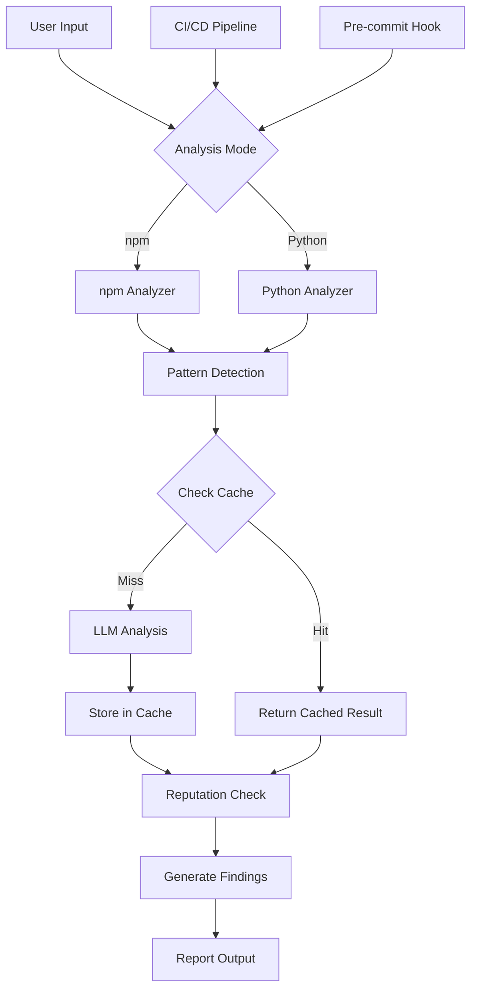

# Design Document: Production-Ready Enhancements

## Overview

This design transforms the Multi-Agent Security Analysis System into a production-ready tool by adding five critical capabilities: Python ecosystem support, intelligent caching, package reputation scoring, comprehensive testing, and CI/CD integration. The implementation prioritizes performance, scalability, and maintainability while expanding language support beyond npm.

## Architecture

### System Architecture Diagram



### Component Overview

1. **Ecosystem Analyzer Framework** - Pluggable analyzers for different package ecosystems
2. **Cache Layer** - Redis/SQLite-based caching for LLM results
3. **Reputation Service** - Queries package registries for metadata (ecosystem-agnostic)
4. **Test Suite** - Unit, property-based, and integration tests
5. **CI/CD Adapters** - GitHub Action and pre-commit hook implementations

## Extensibility Model

**Current Implementation**: npm + Python (2 ecosystems)  
**Future-Ready**: Add new ecosystems by implementing one class

### Adding a New Ecosystem (Example: Java/Maven)

```python
# tools/java_analyzer.py
class JavaAnalyzer(EcosystemAnalyzer):
    @property
    def ecosystem_name(self) -> str:
        return "maven"
    
    def detect_manifest_files(self, directory: str) -> List[str]:
        return [f for f in ['pom.xml'] if os.path.exists(os.path.join(directory, f))]
    
    def extract_dependencies(self, manifest_path: str) -> List[Dict[str, Any]]:
        # Parse pom.xml
        pass
    
    def analyze_install_scripts(self, directory: str) -> List[SecurityFinding]:
        # Check Maven plugins and build scripts
        pass
    
    def get_registry_url(self, package_name: str) -> str:
        return f"https://search.maven.org/solrsearch/select?q=g:{package_name}"
    
    def get_malicious_patterns(self) -> Dict[str, List[str]]:
        return {"critical": [r'Runtime\.getRuntime\(\)\.exec']}

# Register it
registry.register(JavaAnalyzer())
```

**That's it!** The rest of the system (caching, reputation, CI/CD) automatically works with the new ecosystem.

## Components and Interfaces

### 1. Ecosystem Analyzer Framework

**Design Philosophy**: Use an abstract base class to define the analyzer interface, then implement concrete analyzers for each ecosystem. This keeps the code lean while making it trivial to add new languages later.

**Location**: `tools/ecosystem_analyzer.py`

**Base Interface**:

```python
from abc import ABC, abstractmethod
from typing import List, Dict, Any, Optional

class EcosystemAnalyzer(ABC):
    """Abstract base class for ecosystem-specific security analyzers."""
    
    @property
    @abstractmethod
    def ecosystem_name(self) -> str:
        """Return the ecosystem name (e.g., 'npm', 'pypi')."""
        pass
    
    @abstractmethod
    def detect_manifest_files(self, directory: str) -> List[str]:
        """Detect ecosystem-specific manifest files in directory."""
        pass
    
    @abstractmethod
    def extract_dependencies(self, manifest_path: str) -> List[Dict[str, Any]]:
        """Extract dependencies from manifest file."""
        pass
    
    @abstractmethod
    def analyze_install_scripts(self, directory: str) -> List[SecurityFinding]:
        """Analyze installation scripts for malicious patterns."""
        pass
    
    @abstractmethod
    def get_registry_url(self, package_name: str) -> str:
        """Return registry API URL for package metadata."""
        pass
    
    def get_malicious_patterns(self) -> Dict[str, List[str]]:
        """Return ecosystem-specific malicious patterns (optional override)."""
        return {}
```

**Analyzer Registry**:

```python
class AnalyzerRegistry:
    """Central registry for ecosystem analyzers."""
    
    def __init__(self):
        self._analyzers: Dict[str, EcosystemAnalyzer] = {}
    
    def register(self, analyzer: EcosystemAnalyzer):
        """Register an analyzer for an ecosystem."""
        self._analyzers[analyzer.ecosystem_name] = analyzer
    
    def get_analyzer(self, ecosystem: str) -> Optional[EcosystemAnalyzer]:
        """Get analyzer for specific ecosystem."""
        return self._analyzers.get(ecosystem)
    
    def detect_ecosystem(self, directory: str) -> Optional[str]:
        """Auto-detect ecosystem from directory contents."""
        for name, analyzer in self._analyzers.items():
            if analyzer.detect_manifest_files(directory):
                return name
        return None

# Global registry instance
registry = AnalyzerRegistry()
```

### 2. NPM Analyzer (Existing - Refactored)

**Location**: `tools/npm_analyzer.py`

```python
class NpmAnalyzer(EcosystemAnalyzer):
    """npm ecosystem analyzer."""
    
    @property
    def ecosystem_name(self) -> str:
        return "npm"
    
    def detect_manifest_files(self, directory: str) -> List[str]:
        """Detect package.json files."""
        # Implementation for finding package.json
        pass
    
    def extract_dependencies(self, manifest_path: str) -> List[Dict[str, Any]]:
        """Extract dependencies from package.json."""
        # Existing logic
        pass
    
    def analyze_install_scripts(self, directory: str) -> List[SecurityFinding]:
        """Analyze npm scripts (preinstall, postinstall, etc.)."""
        # Existing logic
        pass
    
    def get_registry_url(self, package_name: str) -> str:
        return f"https://registry.npmjs.org/{package_name}"
    
    def get_malicious_patterns(self) -> Dict[str, List[str]]:
        return {
            "critical": [
                r'curl\s+.*\|\s*(?:bash|sh)',
                r'wget\s+.*\|\s*(?:bash|sh)',
                # ... existing npm patterns
            ]
        }

# Register the analyzer
registry.register(NpmAnalyzer())
```

### 3. Python Analyzer (New)

**Location**: `tools/python_analyzer.py`

```python
class PythonAnalyzer(EcosystemAnalyzer):
    """Python/PyPI ecosystem analyzer."""
    
    @property
    def ecosystem_name(self) -> str:
        return "pypi"
    
    def detect_manifest_files(self, directory: str) -> List[str]:
        """Detect setup.py, requirements.txt, pyproject.toml."""
        manifests = []
        for file in ['setup.py', 'requirements.txt', 'pyproject.toml']:
            path = os.path.join(directory, file)
            if os.path.exists(path):
                manifests.append(path)
        return manifests
    
    def extract_dependencies(self, manifest_path: str) -> List[Dict[str, Any]]:
        """Extract dependencies from requirements.txt or setup.py."""
        if manifest_path.endswith('requirements.txt'):
            return self._parse_requirements_txt(manifest_path)
        elif manifest_path.endswith('setup.py'):
            return self._parse_setup_py(manifest_path)
        # ... handle pyproject.toml
    
    def analyze_install_scripts(self, directory: str) -> List[SecurityFinding]:
        """Analyze setup.py for malicious installation hooks."""
        findings = []
        setup_py = os.path.join(directory, 'setup.py')
        if os.path.exists(setup_py):
            findings.extend(self._analyze_setup_py(setup_py))
        return findings
    
    def get_registry_url(self, package_name: str) -> str:
        return f"https://pypi.org/pypi/{package_name}/json"
    
    def get_malicious_patterns(self) -> Dict[str, List[str]]:
        return {
            "critical": [
                r'os\.system\s*\(',
                r'subprocess\.(?:call|run|Popen)\s*\(',
                r'eval\s*\(',
                r'exec\s*\(',
                r'urllib\.request\.urlopen',
            ],
            "high": [
                r'open\s*\(\s*["\'](?:/etc/|/root/|~/.ssh)',
                r'__import__\s*\(["\'](?:os|subprocess)',
            ]
        }
    
    def _analyze_setup_py(self, file_path: str) -> List[SecurityFinding]:
        """Analyze setup.py using AST parsing."""
        # Use ast module for safe parsing
        # Check for cmdclass, setup_requires, install_requires
        # Detect malicious patterns
        pass

# Register the analyzer
registry.register(PythonAnalyzer())
```

**Key Benefits of This Approach**:
1. **Lean**: Only implement npm and Python analyzers now
2. **Flexible**: Adding Java/Go/Rust later is just creating a new class
3. **Clean**: Each analyzer is self-contained with its own patterns
4. **Testable**: Easy to mock and test individual analyzers
5. **Discoverable**: Auto-detection works across all registered analyzers

### 2. Caching System

**Location**: `tools/cache_manager.py`

**Interface**:

```python
class CacheManager:
    def __init__(self, backend: str = "sqlite", ttl_hours: int = 168):
        """
        Initialize cache with configurable backend.
        
        Args:
            backend: "sqlite", "redis", or "memory"
            ttl_hours: Time-to-live for cache entries (default: 1 week)
        """
    
    def get_llm_analysis(self, script_hash: str) -> Optional[Dict[str, Any]]:
        """Retrieve cached LLM analysis result."""
    
    def store_llm_analysis(self, script_hash: str, result: Dict[str, Any]):
        """Store LLM analysis result with TTL."""
    
    def get_reputation(self, package_key: str) -> Optional[Dict[str, Any]]:
        """Retrieve cached reputation data."""
    
    def invalidate(self, key: str):
        """Manually invalidate a cache entry."""
```

**Cache Key Strategy**:
- LLM results: `SHA256(script_content + package_name)`
- Reputation: `{ecosystem}:{package_name}:{version}`
- TTL: 7 days for LLM, 24 hours for reputation

**Storage**:
- Default: SQLite (simple, no dependencies)
- Optional: Redis (for distributed systems)
- Fallback: In-memory dict (if storage fails)

### 4. Reputation Scoring Service (Ecosystem-Agnostic)

**Location**: `tools/reputation_service.py`

**Interface**:

```python
class ReputationScorer:
    """Ecosystem-agnostic reputation scoring service."""
    
    def __init__(self, analyzer_registry: AnalyzerRegistry):
        """Initialize with analyzer registry for ecosystem-specific logic."""
        self.registry = analyzer_registry
    
    def calculate_reputation(self, package_name: str, ecosystem: str) -> Dict[str, Any]:
        """
        Calculate reputation score (0.0-1.0) based on multiple factors.
        Works across all ecosystems by using the analyzer registry.
        
        Returns:
            {
                "score": 0.0-1.0,
                "factors": {
                    "age_score": 0.0-1.0,
                    "downloads_score": 0.0-1.0,
                    "author_score": 0.0-1.0,
                    "maintenance_score": 0.0-1.0
                },
                "flags": ["new_package", "low_downloads", "unknown_author"],
                "metadata": {...}
            }
        """
        analyzer = self.registry.get_analyzer(ecosystem)
        if not analyzer:
            raise ValueError(f"Unsupported ecosystem: {ecosystem}")
        
        # Fetch metadata using ecosystem-specific registry URL
        metadata = self._fetch_metadata(analyzer.get_registry_url(package_name))
        
        # Calculate scores (same logic for all ecosystems)
        return self._calculate_scores(metadata)
    
    def _fetch_metadata(self, registry_url: str) -> Dict[str, Any]:
        """Fetch package metadata from registry (ecosystem-agnostic)."""
        # HTTP request with caching and error handling
        pass
    
    def _calculate_scores(self, metadata: Dict[str, Any]) -> Dict[str, Any]:
        """Calculate reputation scores from metadata (ecosystem-agnostic)."""
        # Same scoring logic for all ecosystems
        pass
```

**Scoring Factors**:

1. **Age Score** (0-1.0):
   - < 30 days: 0.2
   - 30-90 days: 0.5
   - 90-365 days: 0.7
   - 1-2 years: 0.9
   - 2+ years: 1.0

2. **Downloads Score** (0-1.0):
   - < 100/week: 0.2
   - 100-1K/week: 0.5
   - 1K-10K/week: 0.7
   - 10K-100K/week: 0.9
   - 100K+/week: 1.0

3. **Author Score** (0-1.0):
   - Unknown author: 0.3
   - New author (< 1 year): 0.5
   - Established author: 0.8
   - Verified/org: 1.0

4. **Maintenance Score** (0-1.0):
   - Last update > 2 years: 0.2
   - Last update 1-2 years: 0.5
   - Last update 6-12 months: 0.7
   - Last update < 6 months: 1.0

**Overall Reputation**:
```python
reputation = (age * 0.3) + (downloads * 0.3) + (author * 0.2) + (maintenance * 0.2)
```

**Thresholds**:
- < 0.3: High risk (flag as finding)
- 0.3-0.6: Medium risk (warn)
- 0.6-0.8: Low risk (note)
- > 0.8: Trusted

### 5. Test Suite Architecture

**Structure**:
```
tests/
├── unit/
│   ├── test_ecosystem_analyzer.py      # Test base framework
│   ├── test_npm_analyzer.py            # npm-specific tests
│   ├── test_python_analyzer.py         # Python-specific tests
│   ├── test_cache_manager.py
│   └── test_reputation_service.py
├── property/
│   ├── test_analyzer_properties.py     # Properties for all analyzers
│   ├── test_cache_properties.py
│   └── test_reputation_properties.py
├── integration/
│   ├── test_end_to_end_npm.py
│   ├── test_end_to_end_python.py
│   └── test_ci_cd_integration.py
└── fixtures/
    ├── npm/
    │   ├── malicious/
    │   └── benign/
    └── python/
        ├── malicious/
        └── benign/
```

**Testing Framework**: pytest + Hypothesis

**Coverage Target**: 80%+ overall, 90%+ for security-critical code

### 6. CI/CD Integration

**GitHub Action** (`.github/workflows/security-scan.yml`):
```yaml
name: Security Scan
on: [push, pull_request]
jobs:
  scan:
    runs-on: ubuntu-latest
    steps:
      - uses: actions/checkout@v3
      - name: Run Security Analysis
        uses: ./
        with:
          mode: local
          fail-on: critical
```

**Pre-commit Hook** (`.pre-commit-config.yaml`):
```yaml
repos:
  - repo: local
    hooks:
      - id: security-scan
        name: Security Analysis
        entry: python main_github.py --local . --ci-mode
        language: python
        pass_filenames: false
```

## Data Models

### Python Finding Structure

```python
SecurityFinding(
    package="malicious-setup",
    version="1.0.0",
    finding_type="malicious_python_script",
    severity="critical",
    confidence=0.95,
    evidence=[
        "Script: setup.py",
        "Pattern: os.system in setup()",
        "Downloads and executes remote code during installation"
    ],
    recommendations=[...],
    source="python_script_analysis"
)
```

### Cache Entry Structure

```python
{
    "key": "sha256_hash",
    "value": {
        "is_suspicious": true,
        "confidence": 0.95,
        "severity": "critical",
        "threats": [...],
        "reasoning": "..."
    },
    "created_at": "2025-12-02T01:00:00",
    "expires_at": "2025-12-09T01:00:00",
    "hit_count": 5
}
```

### Reputation Data Structure

```python
{
    "package": "suspicious-pkg",
    "ecosystem": "npm",
    "reputation_score": 0.25,
    "factors": {
        "age_score": 0.2,
        "downloads_score": 0.1,
        "author_score": 0.3,
        "maintenance_score": 0.4
    },
    "flags": ["new_package", "low_downloads"],
    "metadata": {
        "created": "2025-11-01",
        "weekly_downloads": 50,
        "author": "unknown-dev",
        "last_update": "2025-11-15"
    }
}
```

## Correctness Properties

*A property is a characteristic or behavior that should hold true across all valid executions of a system-essentially, a formal statement about what the system should do. Properties serve as the bridge between human-readable specifications and machine-verifiable correctness guarantees.*

### Property 1: Installation Hook Extraction Completeness
*For any* valid setup.py file containing installation hooks (cmdclass, setup_requires, install_requires), the analyzer should extract and return all hooks present in the file.
**Validates: Requirements 1.1**

### Property 2: Malicious Pattern Detection
*For any* setup.py file containing known malicious patterns (os.system, subprocess.call, eval, exec, urllib.request), the analyzer should flag it as a security finding with appropriate severity.
**Validates: Requirements 1.2**

### Property 3: Requirements File Package Lookup
*For any* requirements.txt file with package entries, the analyzer should perform a malicious package database lookup for each package listed.
**Validates: Requirements 1.3**

### Property 4: Recursive Dependency Scanning
*For any* Python project with nested dependencies, the analyzer should discover and scan all transitive dependencies, not just direct dependencies.
**Validates: Requirements 1.4**

### Property 5: LLM Invocation for Complex Patterns
*For any* script containing complex or obfuscated patterns that match complexity thresholds, the analyzer should invoke LLM analysis rather than relying solely on pattern matching.
**Validates: Requirements 1.5**

### Property 6: Cache-First Lookup
*For any* script analysis request, the system should check the cache before making any LLM API calls, ensuring cache lookup happens first.
**Validates: Requirements 2.1**

### Property 7: Cache Hit Returns Cached Result
*For any* script with a valid cached result, retrieving the analysis should return the cached result without making new LLM API calls.
**Validates: Requirements 2.2**

### Property 8: Expired Cache Refresh
*For any* cache entry that has exceeded its TTL, the next analysis request should trigger a fresh LLM call and update the cache.
**Validates: Requirements 2.3**

### Property 9: Content Hash Consistency
*For any* two identical script contents, the cache key generation should produce identical hash values, ensuring cache hits for duplicate content.
**Validates: Requirements 2.4**

### Property 10: Registry Metadata Fetching
*For any* package being analyzed, the reputation service should fetch metadata from the appropriate package registry (npm, PyPI).
**Validates: Requirements 3.1**

### Property 11: Age Factor in Reputation
*For any* two packages with different ages, the reputation scorer should assign different age scores, with older packages receiving higher scores.
**Validates: Requirements 3.2**

### Property 12: Download Factor in Reputation
*For any* two packages with different download counts, the reputation scorer should assign different download scores, with higher downloads receiving higher scores.
**Validates: Requirements 3.3**

### Property 13: Author Factor in Reputation
*For any* two packages from authors with different histories (new vs established), the reputation scorer should assign different author scores.
**Validates: Requirements 3.4**

### Property 14: Low Reputation Flagging
*For any* package with a reputation score below the threshold (< 0.3), the system should generate a security finding flagging the low reputation.
**Validates: Requirements 3.5**

### Property 15: Pre-commit Critical Blocking
*For any* analysis that detects critical findings when running in pre-commit mode, the system should exit with a non-zero status code to block the commit.
**Validates: Requirements 5.2**

### Property 16: CI Output Format Compliance
*For any* analysis running in CI mode, the output should conform to standard CI formats (JSON, SARIF, or JUnit XML) and be parseable by CI tools.
**Validates: Requirements 5.3**

### Property 17: Critical Finding Exit Code
*For any* analysis that detects one or more critical severity findings in CI mode, the system should exit with a non-zero status code.
**Validates: Requirements 5.4**

## Error Handling

### Python Analysis Errors
- **Invalid setup.py syntax**: Log warning, skip LLM analysis, continue with pattern matching
- **Missing requirements.txt**: Not an error, simply skip requirements analysis
- **Registry API failures**: Use cached data if available, otherwise log warning and continue
- **Timeout during pip dependency resolution**: Log error, analyze only direct dependencies

### Cache Errors
- **Cache storage failure**: Log warning, continue analysis without caching
- **Cache corruption**: Clear corrupted entries, rebuild cache on next analysis
- **Cache backend unavailable**: Fall back to in-memory cache for session
- **Disk space exhausted**: Implement LRU eviction, remove oldest entries

### Reputation Service Errors
- **Registry API rate limiting**: Implement exponential backoff, use cached data
- **Package not found in registry**: Assign default low reputation score (0.3)
- **Network timeout**: Use cached reputation if available, otherwise skip reputation check
- **Invalid metadata format**: Log warning, use partial data if possible

### CI/CD Integration Errors
- **GitHub API authentication failure**: Exit with error code 1, provide clear error message
- **Pre-commit hook timeout**: Exit with error code 124, suggest increasing timeout
- **Output format serialization error**: Fall back to plain text output
- **Configuration file missing**: Use default configuration, log warning

## Testing Strategy

### Unit Testing
**Framework**: pytest  
**Coverage Target**: 80%+ overall, 90%+ for security-critical modules

**Test Categories**:
1. **Python Analyzer Tests**
   - Test setup.py parsing with various syntaxes
   - Test malicious pattern detection (true positives)
   - Test benign code (false positive prevention)
   - Test requirements.txt parsing edge cases

2. **Cache Manager Tests**
   - Test cache hit/miss scenarios
   - Test TTL expiration
   - Test hash collision handling
   - Test backend fallback mechanisms

3. **Reputation Service Tests**
   - Test score calculation with various metadata
   - Test threshold-based flagging
   - Test API error handling
   - Test caching of reputation data

4. **CI/CD Integration Tests**
   - Test exit codes for various finding severities
   - Test output format generation (JSON, SARIF)
   - Test configuration parsing
   - Test timeout handling

### Property-Based Testing
**Framework**: Hypothesis  
**Minimum Iterations**: 100 per property

**Property Test Implementation**:
- Each correctness property listed above will be implemented as a property-based test
- Tests will use Hypothesis to generate random inputs (scripts, packages, configurations)
- Each test will be tagged with: `**Feature: production-ready-enhancements, Property X: [property text]**`
- Tests will verify properties hold across diverse, randomly generated inputs

**Example Property Test**:
```python
from hypothesis import given, strategies as st

@given(st.text(min_size=10, max_size=1000))
def test_property_9_content_hash_consistency(script_content):
    """
    **Feature: production-ready-enhancements, Property 9: Content Hash Consistency**
    
    For any two identical script contents, cache key generation should 
    produce identical hash values.
    """
    cache_manager = CacheManager()
    hash1 = cache_manager.generate_cache_key(script_content)
    hash2 = cache_manager.generate_cache_key(script_content)
    assert hash1 == hash2
```

### Integration Testing
**Test Scenarios**:
1. **End-to-End npm Analysis**: Analyze real npm project with package.json and scripts
2. **End-to-End Python Analysis**: Analyze real Python project with setup.py and requirements.txt
3. **Cache Performance Test**: Verify 10x speedup on repeated analysis
4. **Reputation Integration**: Verify reputation scores appear in final reports
5. **CI/CD Workflow**: Test GitHub Action and pre-commit hook in real repository

**Test Data**:
- Use `tests/fixtures/` for sample projects
- Include both malicious and benign examples
- Cover edge cases (empty files, large files, unusual formats)

### Performance Testing
**Benchmarks**:
- Cache hit latency: < 100ms
- Full analysis (50 packages): < 60 seconds with cache, < 5 minutes without
- Memory usage: < 500MB for typical projects
- Cache storage: < 100MB for 1000 cached analyses

## Implementation Notes

### Python Analyzer Implementation
- Use `ast` module for safe setup.py parsing (don't execute code)
- Use `requirements-parser` library for requirements.txt parsing
- Use `pipdeptree` or `pip show` for dependency tree analysis
- Implement timeout protection for long-running analyses

### Cache Implementation
- Default to SQLite for simplicity (single file, no server)
- Schema: `CREATE TABLE cache (key TEXT PRIMARY KEY, value TEXT, created_at INTEGER, expires_at INTEGER, hit_count INTEGER)`
- Implement connection pooling for concurrent access
- Add cache statistics endpoint for monitoring

### Reputation Service Implementation
- Use `requests` with retry logic for registry APIs
- npm registry: `https://registry.npmjs.org/{package}`
- PyPI registry: `https://pypi.org/pypi/{package}/json`
- Implement rate limiting (max 10 requests/second)
- Cache reputation data for 24 hours

### CI/CD Implementation
- GitHub Action: Use Docker container for consistent environment
- Pre-commit hook: Use `pre-commit` framework for easy installation
- Support configuration via `.security-scan.yml` file
- Provide clear documentation and examples

## Dependencies

### New Python Packages
- `hypothesis` - Property-based testing framework
- `requirements-parser` - Parse requirements.txt files
- `redis` (optional) - Redis cache backend
- `pyyaml` - Configuration file parsing
- `pytest-cov` - Code coverage reporting

### External Services
- npm registry API (public, no auth required)
- PyPI JSON API (public, no auth required)
- OpenAI API (existing, for LLM analysis)

## Deployment Considerations

### Configuration
- Environment variables for API keys and cache settings
- Configuration file (`.security-scan.yml`) for project-specific settings
- Sensible defaults for all configuration options

### Monitoring
- Log cache hit rates and performance metrics
- Track API usage and costs
- Monitor error rates and types
- Provide health check endpoint

### Scalability
- Cache enables horizontal scaling (shared Redis cache)
- Stateless design allows multiple instances
- Rate limiting prevents API abuse
- Async analysis for large projects (future enhancement)

